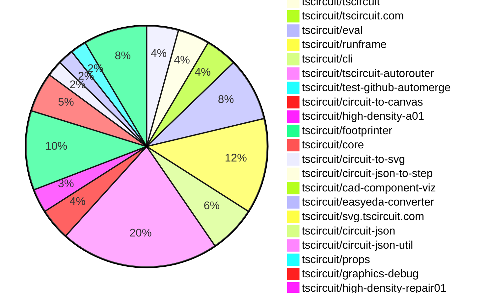

# contribution tracker

[contributions.tscircuit.com](https://contributions.tscircuit.com) ・ [tscircuit.com](https://tscircuit.com) ・ [Contribution Overviews](./contribution-overviews/) ・ [Changelogs](./changelogs/)

Generates weekly contribution overviews for tscircuit contributors. Check out all
the [contribution overviews here](./contribution-overviews/)
You can find AI-generated monthly changelogs in the [changelogs directory](./changelogs/)

- All PRs in the tscircuit org are scanned/summarized via an LLM
- The LLM classifies each Diff/PR as into a set of attributes for scoring
- All the PRs, summaries, and classifications are organized into charts and tables for [the website](https://contributions.tscircuit.com)

> Want to run locally? See the [Development Section](#development)

## Current Week

<!-- START_CURRENT_WEEK -->

# Contribution Overview 2026-04-07

The current week is shown below. There are 3 major sections:

- [Contributor Overview](#contributor-overview)
- [PRs by Repository](#prs-by-repository)
- [PRs by Contributor](#changes-by-contributor)
- [Scoring & Sponsorship Details](/docs/sponsorship-calculation-explanation.md)

## PRs by Repository



## Contributor Overview

| Contributor | 🐳 Major | 🐙 Minor | 🐌 Tiny | Score | ⭐ | Discussion Contributions |
|-------------|---------|---------|---------|-------|-----|--------------------------|
| [seveibar](#seveibar) | 5 | 3 | 6 | 33 | ⭐⭐ | 0🔹 0🔶 0💎 |
| [MustafaMulla29](#MustafaMulla29) | 1 | 5 | 12 | 27 | ⭐⭐ | 0🔹 0🔶 0💎 |
| [Abse2001](#Abse2001) | 3 | 1 | 1 | 23 | ⭐⭐ | 0🔹 0🔶 0💎 |
| [tscircuitbot](#tscircuitbot) | 0 | 0 | 46 | 13 | ⭐⭐ | 0🔹 0🔶 0💎 |
| [ShiboSoftwareDev](#ShiboSoftwareDev) | 1 | 2 | 0 | 10 | ⭐ | 0🔹 0🔶 0💎 |
| [AnasSarkiz](#AnasSarkiz) | 0 | 1 | 7 | 9.5 | ⭐ | 0🔹 0🔶 0💎 |
| [techmannih](#techmannih) | 0 | 0 | 6 | 6 | ⭐ | 0🔹 0🔶 0💎 |
| [mohan-bee](#mohan-bee) | 1 | 1 | 0 | 6 | ⭐ | 0🔹 0🔶 0💎 |

## Staff Pass Ratio (SPR)

| Contributor | Reviewed PRs | Rejections | Approvals | SPR |
|-------------|--------------|------------|-----------|-----|
| [MustafaMulla29](#MustafaMulla29) | 6 | 0 | 6 | 100.0% |
| [ShiboSoftwareDev](#ShiboSoftwareDev) | 4 | 0 | 4 | 100.0% |
| [Abse2001](#Abse2001) | 3 | 0 | 3 | 100.0% |
| [mohan-bee](#mohan-bee) | 3 | 1 | 2 | 66.7% |

<details>
<summary>MustafaMulla29 SPR PRs (6)</summary>

- [#588](https://github.com/tscircuit/footprinter/pull/588) feat(vssop): switch to generic body-based courtyard
- [#585](https://github.com/tscircuit/footprinter/pull/585) Use generic body-based courtyard for SON parity
- [#757](https://github.com/tscircuit/3d-viewer/pull/757) Fix isPcbNoteElement filter for elements without layer prop
- [#2118](https://github.com/tscircuit/core/pull/2118) Feat: add inner symbol for usbc
- [#2116](https://github.com/tscircuit/core/pull/2116) Improve invalid footprint prop reporting for NormalComponent footprint(kicad:) strings
- [#222](https://github.com/tscircuit/circuit-to-canvas/pull/222) Fix pcb_note elements leaking into layer-filtered renders

</details>

<details>
<summary>ShiboSoftwareDev SPR PRs (4)</summary>

- [#528](https://github.com/tscircuit/circuit-json/pull/528) added routing_phase_index to nets and traces
- [#629](https://github.com/tscircuit/props/pull/629) Added optional routingPhaseIndex: number support to both net and trace
- [#2120](https://github.com/tscircuit/core/pull/2120) Fix source_port pin attribute serialization
- [#854](https://github.com/tscircuit/tscircuit-autorouter/pull/854) via clearance

</details>

<details>
<summary>Abse2001 SPR PRs (3)</summary>

- [#729](https://github.com/tscircuit/pcb-viewer/pull/729) Prevent canvas interactions when interacting with toolbar overlay
- [#375](https://github.com/tscircuit/easyeda-converter/pull/375) Fix EasyEDA CAD model placement using bounds fallback and ensure browser/node parity
- [#71](https://github.com/tscircuit/circuit-json-to-step/pull/71) Add STEP styling pipeline with face-level color support and optimized style reuse

</details>

<details>
<summary>mohan-bee SPR PRs (3)</summary>

- [#374](https://github.com/tscircuit/easyeda-converter/pull/374) Preserve {NAME}  placeholder in generated silkscreen text
- [#2622](https://github.com/tscircuit/cli/pull/2622) Fix wrong shell chaining command
- [#26](https://github.com/tscircuit/circuit-json-to-tscircuit/pull/26) Fix source‑subcircuit imports by preserving connectivity and props

</details>

> Note: AI evaluates PRs and assigns 1-3 star ratings automatically. 4 and 5 star ratings require manual staff review.

### Discussion Contribution Legend

- 🔹 Normal Comments: Basic participation with minimal effort
- 🔶 Great Informative Comments: Thoughtful participation that adds value
- 💎 Incredible Comments: Exceptional participation with high-quality content

## Review Table

[reviews-received-hover]: ## "Number of reviews received for PRs for this contributor"
[approvals-received-hover]: ## "Number of approvals received for PRs this contributor authored"
[rejections-received-hover]: ## "Number of rejections received for PRs this contributor authored"
[prs-opened-hover]: ## "Number of PRs opened by this contributor"
[issues-created-hover]: ## "Number of issues created by this contributor"

| Contributor | Reviews Received | Approvals Received | Rejections Received | Approvals | Rejections Given | PRs Opened | PRs Merged | Issues Created |
|---|---|---|---|---|---|---|---|---|
| [tscircuitbot](#tscircuitbot) | 0 | 0 | 0 | 0 | 0 | 73 | 46 | 0 |
| [techmannih](#techmannih) | 8 | 7 | 0 | 0 | 0 | 7 | 6 | 0 |
| [Abse2001](#Abse2001) | 4 | 4 | 0 | 8 | 0 | 5 | 5 | 0 |
| [seveibar](#seveibar) | 2 | 0 | 0 | 23 | 1 | 27 | 14 | 0 |
| [MustafaMulla29](#MustafaMulla29) | 17 | 15 | 0 | 2 | 0 | 22 | 18 | 0 |
| [ShiboSoftwareDev](#ShiboSoftwareDev) | 4 | 4 | 0 | 2 | 0 | 4 | 3 | 0 |
| [mohan-bee](#mohan-bee) | 4 | 2 | 1 | 0 | 0 | 4 | 2 | 0 |
| [techmannih2](#techmannih2) | 0 | 0 | 0 | 0 | 0 | 2 | 0 | 0 |
| [0hmxbot](#0hmxbot) | 0 | 0 | 0 | 0 | 0 | 4 | 0 | 0 |
| [AnasSarkiz](#AnasSarkiz) | 4 | 4 | 0 | 1 | 0 | 13 | 8 | 0 |
| [0hmX](#0hmX) | 0 | 0 | 0 | 0 | 0 | 3 | 0 | 0 |
| [mitchellecm7](#mitchellecm7) | 0 | 0 | 0 | 0 | 0 | 2 | 0 | 0 |
| [aliyevr889](#aliyevr889) | 0 | 0 | 0 | 0 | 0 | 1 | 0 | 0 |
| [Emanuelgm1998](#Emanuelgm1998) | 0 | 0 | 0 | 0 | 0 | 1 | 0 | 0 |

## Changes by Repository

### [tscircuit/pcb-viewer](https://github.com/tscircuit/pcb-viewer)

| PR # | Impact | Rating | Contributor | Description |
|------|--------|--------|-------------|-------------|
| [#729](https://github.com/tscircuit/pcb-viewer/pull/729) | 🐳 Major | ⭐⭐⭐ | Abse2001 | Prevents canvas interactions when the user interacts with the toolbar overlay, ensuring that toolbar actions do not interfere with canvas operations. |

<details>
<summary>🐌 Tiny Contributions (3)</summary>

| PR # | Impact | Contributor | Description |
|------|--------|-------------|-------------|
| [#732](https://github.com/tscircuit/pcb-viewer/pull/732) | 🐌 Tiny | tscircuitbot | Automated package update |
| [#730](https://github.com/tscircuit/pcb-viewer/pull/730) | 🐌 Tiny | tscircuitbot | Automated package update to version 1.11.360 |
| [#731](https://github.com/tscircuit/pcb-viewer/pull/731) | 🐌 Tiny | techmannih | Updates the circuit-to-canvas dependency to version 0.0.95 in package.json |

</details>

### [tscircuit/tscircuit](https://github.com/tscircuit/tscircuit)


<details>
<summary>🐌 Tiny Contributions (4)</summary>

| PR # | Impact | Contributor | Description |
|------|--------|-------------|-------------|
| [#2847](https://github.com/tscircuit/tscircuit/pull/2847) | 🐌 Tiny | tscircuitbot | Updates the package version from 0.0.1600 to 0.0.1601 in package.json |
| [#2846](https://github.com/tscircuit/tscircuit/pull/2846) | 🐌 Tiny | tscircuitbot | Updates the version of several dependencies in the package.json file, including tscircuitcli, tscircuitfootprinter, and circuit-json. |
| [#2845](https://github.com/tscircuit/tscircuit/pull/2845) | 🐌 Tiny | tscircuitbot | Automated package update to version 0.0.1600 |
| [#2840](https://github.com/tscircuit/tscircuit/pull/2840) | 🐌 Tiny | MustafaMulla29 | Updates the versions of the core and eval dependencies in the package.json file. |

</details>

### [tscircuit/tscircuit.com](https://github.com/tscircuit/tscircuit.com)


<details>
<summary>🐌 Tiny Contributions (4)</summary>

| PR # | Impact | Contributor | Description |
|------|--------|-------------|-------------|
| [#3113](https://github.com/tscircuit/tscircuit.com/pull/3113) | 🐌 Tiny | tscircuitbot | Updates the tscircuiteval package to version 0.0.738 in the package.json file. |
| [#3111](https://github.com/tscircuit/tscircuit.com/pull/3111) | 🐌 Tiny | tscircuitbot | Updates the tscircuiteval package to version 0.0.737 |
| [#3108](https://github.com/tscircuit/tscircuit.com/pull/3108) | 🐌 Tiny | tscircuitbot | Automated package update |
| [#3106](https://github.com/tscircuit/tscircuit.com/pull/3106) | 🐌 Tiny | tscircuitbot | Updates the version of the tscircuiteval package from 0.0.734 to 0.0.735 in package.json |

</details>

### [tscircuit/eval](https://github.com/tscircuit/eval)


<details>
<summary>🐌 Tiny Contributions (8)</summary>

| PR # | Impact | Contributor | Description |
|------|--------|-------------|-------------|
| [#2352](https://github.com/tscircuit/eval/pull/2352) | 🐌 Tiny | tscircuitbot | Automated package update |
| [#2350](https://github.com/tscircuit/eval/pull/2350) | 🐌 Tiny | tscircuitbot | Automated package update |
| [#2349](https://github.com/tscircuit/eval/pull/2349) | 🐌 Tiny | tscircuitbot | Automated package update |
| [#2343](https://github.com/tscircuit/eval/pull/2343) | 🐌 Tiny | tscircuitbot | Automated package update |
| [#2342](https://github.com/tscircuit/eval/pull/2342) | 🐌 Tiny | tscircuitbot | Updates the version of the tscircuitcore package from 0.0.1143 to 0.0.1144 in package.json |
| [#2341](https://github.com/tscircuit/eval/pull/2341) | 🐌 Tiny | tscircuitbot | Automated package update |
| [#2340](https://github.com/tscircuit/eval/pull/2340) | 🐌 Tiny | tscircuitbot | Updates the versions of the tscircuitcore and tscircuitfootprinter packages in package.json |
| [#2351](https://github.com/tscircuit/eval/pull/2351) | 🐌 Tiny | MustafaMulla29 | Adds easyeda to the noExternal configuration in multiple build configuration files to ensure it is bundled with the application. |

</details>

### [tscircuit/runframe](https://github.com/tscircuit/runframe)


<details>
<summary>🐌 Tiny Contributions (12)</summary>

| PR # | Impact | Contributor | Description |
|------|--------|-------------|-------------|
| [#3061](https://github.com/tscircuit/runframe/pull/3061) | 🐌 Tiny | tscircuitbot | Updates the package version from v0.0.1794 to v0.0.1795 in package.json |
| [#3060](https://github.com/tscircuit/runframe/pull/3060) | 🐌 Tiny | tscircuitbot | Updates the tscircuiteval package to version 0.0.738 in the package.json file. |
| [#3059](https://github.com/tscircuit/runframe/pull/3059) | 🐌 Tiny | tscircuitbot | Automated package update |
| [#3058](https://github.com/tscircuit/runframe/pull/3058) | 🐌 Tiny | tscircuitbot | Updates the tscircuiteval package from version 0.0.736 to 0.0.737 in the package.json file. |
| [#3057](https://github.com/tscircuit/runframe/pull/3057) | 🐌 Tiny | tscircuitbot | Automated package update |
| [#3056](https://github.com/tscircuit/runframe/pull/3056) | 🐌 Tiny | tscircuitbot | Updates the tscircuitpcb-viewer package from version 1.11.360 to 1.11.361 |
| [#3055](https://github.com/tscircuit/runframe/pull/3055) | 🐌 Tiny | tscircuitbot | Automated package update |
| [#3054](https://github.com/tscircuit/runframe/pull/3054) | 🐌 Tiny | tscircuitbot | Updates the tscircuiteval package from version 0.0.735 to 0.0.736 in the package.json file. |
| [#3053](https://github.com/tscircuit/runframe/pull/3053) | 🐌 Tiny | tscircuitbot | Automated package update |
| [#3052](https://github.com/tscircuit/runframe/pull/3052) | 🐌 Tiny | tscircuitbot | Updates the tscircuiteval package from version 0.0.734 to 0.0.735 in the project dependencies. |
| [#3051](https://github.com/tscircuit/runframe/pull/3051) | 🐌 Tiny | tscircuitbot | Automated package update |
| [#3050](https://github.com/tscircuit/runframe/pull/3050) | 🐌 Tiny | tscircuitbot | Updates the tscircuitpcb-viewer package from version 1.11.359 to 1.11.360 |

</details>

### [tscircuit/cli](https://github.com/tscircuit/cli)

| PR # | Impact | Rating | Contributor | Description |
|------|--------|--------|-------------|-------------|
| [#2622](https://github.com/tscircuit/cli/pull/2622) | 🐙 Minor | ⭐⭐ | mohan-bee | Fixes the shell command chaining from using  to  to ensure proper execution of commands in the CLI. |

<details>
<summary>🐌 Tiny Contributions (5)</summary>

| PR # | Impact | Contributor | Description |
|------|--------|-------------|-------------|
| [#2628](https://github.com/tscircuit/cli/pull/2628) | 🐌 Tiny | tscircuitbot | Automated package update |
| [#2627](https://github.com/tscircuit/cli/pull/2627) | 🐌 Tiny | tscircuitbot | Updates the tscircuitrunframe package to version 0.0.1795 in package.json |
| [#2626](https://github.com/tscircuit/cli/pull/2626) | 🐌 Tiny | tscircuitbot | Automated package update |
| [#2623](https://github.com/tscircuit/cli/pull/2623) | 🐌 Tiny | tscircuitbot | Automated package update |
| [#2625](https://github.com/tscircuit/cli/pull/2625) | 🐌 Tiny | MustafaMulla29 | Updates the easyeda dependency version from 0.0.253 to 0.0.258 in package.json |

</details>

### [tscircuit/tscircuit-autorouter](https://github.com/tscircuit/tscircuit-autorouter)

| PR # | Impact | Rating | Contributor | Description |
|------|--------|--------|-------------|-------------|
| [#854](https://github.com/tscircuit/tscircuit-autorouter/pull/854) | 🐳 Major | ⭐⭐⭐ | ShiboSoftwareDev | Adds functionality to manage via-to-trace clearance during high-density routing, preventing overlaps and ensuring compliance with clearance requirements. |
| [#848](https://github.com/tscircuit/tscircuit-autorouter/pull/848) | 🐳 Major | ⭐⭐⭐ | seveibar | Add stage-by-stage PNG dumps for autorouter pipeline debug runs, including a reusable PipelineStageDebugRunner for logging and PNG artifact generation during pipeline execution. |
| [#842](https://github.com/tscircuit/tscircuit-autorouter/pull/842) | 🐳 Major | ⭐⭐⭐ | seveibar | This pull request introduces a new route stitching solver (MultipleHighDensityRouteStitchSolver3) and replaces the previous solver (MultipleHighDensityRouteStitchSolver) in the autorouting pipeline. It also includes various improvements to the TinyHyperGraph solvers, enhancing their performance and configurability. |
| [#834](https://github.com/tscircuit/tscircuit-autorouter/pull/834) | 🐳 Major | ⭐⭐⭐ | seveibar | Adds a max node ratio of 6 to the autorouting pipeline, improving routing efficiency by 1.4. |
| [#828](https://github.com/tscircuit/tscircuit-autorouter/pull/828) | 🐳 Major | ⭐⭐⭐ | seveibar | Reduces the maximum node dimension from 8 to 7 for the autorouting pipeline5, affecting how nodes are processed in routing algorithms. |
| [#835](https://github.com/tscircuit/tscircuit-autorouter/pull/835) | 🐙 Minor | ⭐⭐ | seveibar | Adds a SolverOptions type and modifies solver instantiation to allow for per-scenario solver tuning via an effort value, while maintaining existing runTask behavior. |

<details>
<summary>🐌 Tiny Contributions (14)</summary>

| PR # | Impact | Contributor | Description |
|------|--------|-------------|-------------|
| [#855](https://github.com/tscircuit/tscircuit-autorouter/pull/855) | 🐌 Tiny | tscircuitbot | Automated package update |
| [#853](https://github.com/tscircuit/tscircuit-autorouter/pull/853) | 🐌 Tiny | tscircuitbot | Automated package update |
| [#849](https://github.com/tscircuit/tscircuit-autorouter/pull/849) | 🐌 Tiny | tscircuitbot | Automated package update |
| [#837](https://github.com/tscircuit/tscircuit-autorouter/pull/837) | 🐌 Tiny | tscircuitbot | Automated package update |
| [#829](https://github.com/tscircuit/tscircuit-autorouter/pull/829) | 🐌 Tiny | tscircuitbot | Automated package update |
| [#832](https://github.com/tscircuit/tscircuit-autorouter/pull/832) | 🐌 Tiny | tscircuitbot | Automated package update |
| [#839](https://github.com/tscircuit/tscircuit-autorouter/pull/839) | 🐌 Tiny | tscircuitbot | Automated package update |
| [#847](https://github.com/tscircuit/tscircuit-autorouter/pull/847) | 🐌 Tiny | tscircuitbot | Automated package update |
| [#844](https://github.com/tscircuit/tscircuit-autorouter/pull/844) | 🐌 Tiny | tscircuitbot | Automated package update |
| [#838](https://github.com/tscircuit/tscircuit-autorouter/pull/838) | 🐌 Tiny | tscircuitbot | Automated package update |
| [#841](https://github.com/tscircuit/tscircuit-autorouter/pull/841) | 🐌 Tiny | seveibar | Trims high-density node marker labels by removing the connection list to improve readability in visualization flows. |
| [#830](https://github.com/tscircuit/tscircuit-autorouter/pull/830) | 🐌 Tiny | seveibar | Adds a fixture and regression test for reproducing and debugging autorouting bug report 569cfe9b-1c74-4e59-b360-32ccaacfb0be, including an SVG snapshot for visualization comparison. |
| [#836](https://github.com/tscircuit/tscircuit-autorouter/pull/836) | 🐌 Tiny | seveibar | Sets the autorouting debugging fixture to use Pipeline 4 by default when no pipeline is stored in localStorage. |
| [#840](https://github.com/tscircuit/tscircuit-autorouter/pull/840) | 🐌 Tiny | seveibar | Adds an optional isCopperPour flag to the Obstacle type in SimpleRouteJson and updates the README to document this new flag. |

</details>

### [tscircuit/test-github-automerge](https://github.com/tscircuit/test-github-automerge)


<details>
<summary>🐌 Tiny Contributions (1)</summary>

| PR # | Impact | Contributor | Description |
|------|--------|-------------|-------------|
| [#38](https://github.com/tscircuit/test-github-automerge/pull/38) | 🐌 Tiny | tscircuitbot | Updates the tscircuitcircuit-json-util package from version 0.0.90 to 0.0.91 in the development dependencies. |

</details>

### [tscircuit/circuit-to-canvas](https://github.com/tscircuit/circuit-to-canvas)


<details>
<summary>🐌 Tiny Contributions (4)</summary>

| PR # | Impact | Contributor | Description |
|------|--------|-------------|-------------|
| [#224](https://github.com/tscircuit/circuit-to-canvas/pull/224) | 🐌 Tiny | tscircuitbot | Automated package update |
| [#221](https://github.com/tscircuit/circuit-to-canvas/pull/221) | 🐌 Tiny | tscircuitbot | Automated package update |
| [#220](https://github.com/tscircuit/circuit-to-canvas/pull/220) | 🐌 Tiny | techmannih | Adds support for round line joins in the rendering of PCB courtyard rectangles and outlines. |
| [#223](https://github.com/tscircuit/circuit-to-canvas/pull/223) | 🐌 Tiny | MustafaMulla29 | Updates the version of the tscircuitcircuit-json-util dependency from 0.0.78 to 0.0.91 in package.json |

</details>

### [tscircuit/high-density-a01](https://github.com/tscircuit/high-density-a01)

| PR # | Impact | Rating | Contributor | Description |
|------|--------|--------|-------------|-------------|
| [#50](https://github.com/tscircuit/high-density-a01/pull/50) | 🐳 Major | ⭐⭐⭐ | seveibar | This pull request introduces the HighDensitySolverA05, which enhances the existing high-density routing capabilities by adding route normalization and force-directed reflow after each solved route. It includes new parameters for controlling the routing behavior and improves the overall routing efficiency. |

<details>
<summary>🐌 Tiny Contributions (2)</summary>

| PR # | Impact | Contributor | Description |
|------|--------|-------------|-------------|
| [#54](https://github.com/tscircuit/high-density-a01/pull/54) | 🐌 Tiny | tscircuitbot | Updates the package version from 0.0.25 to 0.0.27 in package.json |
| [#53](https://github.com/tscircuit/high-density-a01/pull/53) | 🐌 Tiny | seveibar | This pull request introduces new examples for the superhard dataset and improves the existing A05 functionality. It includes new fixture files and a dataset JSON file that contains various scenarios and their corresponding solver results. The changes aim to enhance the testing and debugging capabilities of the project. |

</details>

### [tscircuit/footprinter](https://github.com/tscircuit/footprinter)

| PR # | Impact | Rating | Contributor | Description |
|------|--------|--------|-------------|-------------|
| [#588](https://github.com/tscircuit/footprinter/pull/588) | 🐳 Major | ⭐⭐⭐ | MustafaMulla29 | Switches the courtyard representation for VSSOP components from a rectangular format to a generic body-based outline format, enhancing the accuracy of component layout. |
| [#585](https://github.com/tscircuit/footprinter/pull/585) | 🐙 Minor | ⭐⭐ | MustafaMulla29 | Changes the courtyard representation for SON components from a rectangular format to a more generic outline format, improving the accuracy of component layout in PCB designs. |

<details>
<summary>🐌 Tiny Contributions (8)</summary>

| PR # | Impact | Contributor | Description |
|------|--------|-------------|-------------|
| [#593](https://github.com/tscircuit/footprinter/pull/593) | 🐌 Tiny | techmannih | Fixes dimensions and coordinates for SOT and SOD packages to align with KiCad standards |
| [#592](https://github.com/tscircuit/footprinter/pull/592) | 🐌 Tiny | techmannih | Updates the circuit-to-svg dependency to version 0.0.342 in package.json |
| [#591](https://github.com/tscircuit/footprinter/pull/591) | 🐌 Tiny | MustafaMulla29 | Updates courtyard geometry for various components and adds parity tests to ensure consistency with KiCad. |
| [#590](https://github.com/tscircuit/footprinter/pull/590) | 🐌 Tiny | MustafaMulla29 | Fixes courtyard dimensions for JST, SOT, TO220, VSON, and electrolytic components to ensure proper layout and spacing in PCB designs. |
| [#589](https://github.com/tscircuit/footprinter/pull/589) | 🐌 Tiny | MustafaMulla29 | Fixes courtyard definitions for BGA, DIP, SOD923, SOT223, and axial components to ensure accurate PCB layout. |
| [#584](https://github.com/tscircuit/footprinter/pull/584) | 🐌 Tiny | MustafaMulla29 | Fixes courtyard generation for quad components to utilize a body-based approach, improving accuracy in PCB layout. |
| [#587](https://github.com/tscircuit/footprinter/pull/587) | 🐌 Tiny | MustafaMulla29 | Updates the TSSOP courtyard definition to use a generic body-based stepped outline instead of a rectangular courtyard, improving the accuracy of component footprints. |
| [#586](https://github.com/tscircuit/footprinter/pull/586) | 🐌 Tiny | MustafaMulla29 | Changes the SOP8 footprint to use a generic stepped courtyard outline instead of a rectangular courtyard, improving the accuracy of the footprint representation. |

</details>

### [tscircuit/core](https://github.com/tscircuit/core)

| PR # | Impact | Rating | Contributor | Description |
|------|--------|--------|-------------|-------------|
| [#2121](https://github.com/tscircuit/core/pull/2121) | 🐙 Minor | ⭐⭐ | MustafaMulla29 | Adds a layer property to various PCB note components, allowing for better control over their rendering on different layers. |
| [#2116](https://github.com/tscircuit/core/pull/2116) | 🐙 Minor | ⭐⭐ | MustafaMulla29 | Adds better error reporting for invalid footprint properties in NormalComponent, specifically for KiCad footprint strings. |
| [#2120](https://github.com/tscircuit/core/pull/2120) | 🐙 Minor | ⭐⭐ | ShiboSoftwareDev | Fixes serialization of pin attributes for source_port records to ensure proper DRC checks for power and ground requirements. |

<details>
<summary>🐌 Tiny Contributions (2)</summary>

| PR # | Impact | Contributor | Description |
|------|--------|-------------|-------------|
| [#2119](https://github.com/tscircuit/core/pull/2119) | 🐌 Tiny | techmannih | Updates the circuit-to-svg dependency version from 0.0.337 to 0.0.342 in package.json |
| [#2117](https://github.com/tscircuit/core/pull/2117) | 🐌 Tiny | MustafaMulla29 | Updates the footprinter dependency from version 0.0.338 to 0.0.346 in package.json and modifies a test to expect two errors instead of one. |

</details>

### [tscircuit/circuit-to-svg](https://github.com/tscircuit/circuit-to-svg)


<details>
<summary>🐌 Tiny Contributions (2)</summary>

| PR # | Impact | Contributor | Description |
|------|--------|-------------|-------------|
| [#538](https://github.com/tscircuit/circuit-to-svg/pull/538) | 🐌 Tiny | techmannih | Adds support for round line joins in the SVG rendering of PCB courtyards, enhancing the visual representation of PCB outlines. |
| [#541](https://github.com/tscircuit/circuit-to-svg/pull/541) | 🐌 Tiny | MustafaMulla29 | Fixes an issue where inner symbols are rendered incorrectly beneath a yellow box in schematic components. |

</details>

### [tscircuit/circuit-json-to-step](https://github.com/tscircuit/circuit-json-to-step)

| PR # | Impact | Rating | Contributor | Description |
|------|--------|--------|-------------|-------------|
| [#71](https://github.com/tscircuit/circuit-json-to-step/pull/71) | 🐳 Major | ⭐⭐⭐ | Abse2001 | Adds a STEP styling pipeline that supports face-level color customization and optimizes style reuse for circuit board rendering. |

### [tscircuit/cad-component-viz](https://github.com/tscircuit/cad-component-viz)

| PR # | Impact | Rating | Contributor | Description |
|------|--------|--------|-------------|-------------|
| [#5](https://github.com/tscircuit/cad-component-viz/pull/5) | 🐳 Major | ⭐⭐⭐ | Abse2001 | Adds a drag-and-drop interface for loading CAD models on the landing page and enhances the viewer model loading workflow. |

### [tscircuit/easyeda-converter](https://github.com/tscircuit/easyeda-converter)

| PR # | Impact | Rating | Contributor | Description |
|------|--------|--------|-------------|-------------|
| [#374](https://github.com/tscircuit/easyeda-converter/pull/374) | 🐳 Major | ⭐⭐⭐ | mohan-bee | this PR fixes easyeda generated chip footprints to preserve the NAME silkscreen placeholder instead of converting it to props.name, preventing runtime text required errors in the editor. |
| [#375](https://github.com/tscircuit/easyeda-converter/pull/375) | 🐙 Minor | ⭐⭐ | Abse2001 | Fixes EasyEDA CAD model placement by implementing bounds fallback and ensuring consistent behavior between browser and Node.js environments. |

### [tscircuit/svg.tscircuit.com](https://github.com/tscircuit/svg.tscircuit.com)


<details>
<summary>🐌 Tiny Contributions (1)</summary>

| PR # | Impact | Contributor | Description |
|------|--------|-------------|-------------|
| [#1289](https://github.com/tscircuit/svg.tscircuit.com/pull/1289) | 🐌 Tiny | Abse2001 | Updates the circuit-json-to-gltf dependency from version 0.0.74 to 0.0.93 in the package.json file. |

</details>

### [tscircuit/circuit-json](https://github.com/tscircuit/circuit-json)

| PR # | Impact | Rating | Contributor | Description |
|------|--------|--------|-------------|-------------|
| [#529](https://github.com/tscircuit/circuit-json/pull/529) | 🐙 Minor | ⭐⭐ | MustafaMulla29 | Adds a layer property to various PCB note types, allowing for better layer management in PCB designs. |

### [tscircuit/circuit-json-util](https://github.com/tscircuit/circuit-json-util)

| PR # | Impact | Rating | Contributor | Description |
|------|--------|--------|-------------|-------------|
| [#91](https://github.com/tscircuit/circuit-json-util/pull/91) | 🐙 Minor | ⭐⭐ | MustafaMulla29 | Returns user_note render layers for pcb_note elements, ensuring they are correctly excluded from layer-filtered renders. |

### [tscircuit/props](https://github.com/tscircuit/props)

| PR # | Impact | Rating | Contributor | Description |
|------|--------|--------|-------------|-------------|
| [#629](https://github.com/tscircuit/props/pull/629) | 🐙 Minor | ⭐⭐ | ShiboSoftwareDev | Adds optional support for routingPhaseIndex as a number or null in NetProps and TraceProps interfaces, enhancing routing capabilities. |
| [#628](https://github.com/tscircuit/props/pull/628) | 🐙 Minor | ⭐⭐ | seveibar | Add an optional unbroken boolean to CopperPourProps to indicate that the copper pour should remain unbroken during processing or rendering. |

### [tscircuit/graphics-debug](https://github.com/tscircuit/graphics-debug)

| PR # | Impact | Rating | Contributor | Description |
|------|--------|--------|-------------|-------------|
| [#109](https://github.com/tscircuit/graphics-debug/pull/109) | 🐙 Minor | ⭐⭐ | seveibar | Add functionality to convert graphics objects into PNG format, allowing users to export visual representations of graphics objects as PNG images. |

### [tscircuit/high-density-repair01](https://github.com/tscircuit/high-density-repair01)


<details>
<summary>🐌 Tiny Contributions (1)</summary>

| PR # | Impact | Contributor | Description |
|------|--------|-------------|-------------|
| [#1](https://github.com/tscircuit/high-density-repair01/pull/1) | 🐌 Tiny | seveibar | wip minor Add hd08 repair pipeline and failing-sample tooling |

</details>

### [tscircuit/high-density-repair02](https://github.com/tscircuit/high-density-repair02)

| PR # | Impact | Rating | Contributor | Description |
|------|--------|--------|-------------|-------------|
| [#35](https://github.com/tscircuit/high-density-repair02/pull/35) | 🐙 Minor | ⭐⭐ | AnasSarkiz | Adds detailed benchmark reporting with a full metrics breakdown and a comparison of performance deltas between the current PR and the main branch. |

<details>
<summary>🐌 Tiny Contributions (7)</summary>

| PR # | Impact | Contributor | Description |
|------|--------|-------------|-------------|
| [#39](https://github.com/tscircuit/high-density-repair02/pull/39) | 🐌 Tiny | AnasSarkiz | Moves benchmark and test assets to a new directory structure under datasets and updates related scripts, fixtures, tests, and CI inputs accordingly. |
| [#38](https://github.com/tscircuit/high-density-repair02/pull/38) | 🐌 Tiny | AnasSarkiz | Refactors the dataset organization by renaming and restructuring dataset-related scripts and fixtures for improved clarity and maintainability. |
| [#37](https://github.com/tscircuit/high-density-repair02/pull/37) | 🐌 Tiny | AnasSarkiz | Adds a dataset selector and modifies the scenario limit for benchmark tests to default to 5000 scenarios, with an option to run all scenarios. |
| [#33](https://github.com/tscircuit/high-density-repair02/pull/33) | 🐌 Tiny | AnasSarkiz | This pull request introduces a new feature that replaces noisy logs in the benchmark workflow with actionable summary tables. The changes include modifications to the benchmark workflow files to enhance the output format, making it easier to interpret benchmark results. Additionally, a new JSON file is created to store benchmark results, which can be referenced in the summary tables. |
| [#31](https://github.com/tscircuit/high-density-repair02/pull/31) | 🐌 Tiny | AnasSarkiz | Adds a comprehensive GitHub Actions workflow for benchmarking that triggers on pull requests, allowing for argument parsing and automated reporting of results. |
| [#30](https://github.com/tscircuit/high-density-repair02/pull/30) | 🐌 Tiny | AnasSarkiz | Adds a new React component that provides fixtures for circuit and bug report cases, allowing users to load and debug various asset problems. |
| [#34](https://github.com/tscircuit/high-density-repair02/pull/34) | 🐌 Tiny | AnasSarkiz | Updates the README to correct the description of the project by adding A at the beginning of the project description. |

</details>

## Changes by Contributor

### [tscircuitbot](https://github.com/tscircuitbot)


<details>
<summary>🐌 Tiny Contributions (46)</summary>

| PR # | Impact | Description |
|------|--------|-------------|
| [#732](https://github.com/tscircuit/pcb-viewer/pull/732) | 🐌 Tiny | Automated package update |
| [#730](https://github.com/tscircuit/pcb-viewer/pull/730) | 🐌 Tiny | Automated package update to version 1.11.360 |
| [#2847](https://github.com/tscircuit/tscircuit/pull/2847) | 🐌 Tiny | Updates the package version from 0.0.1600 to 0.0.1601 in package.json |
| [#2846](https://github.com/tscircuit/tscircuit/pull/2846) | 🐌 Tiny | Updates the version of several dependencies in the package.json file, including tscircuitcli, tscircuitfootprinter, and circuit-json. |
| [#2845](https://github.com/tscircuit/tscircuit/pull/2845) | 🐌 Tiny | Automated package update to version 0.0.1600 |
| [#3113](https://github.com/tscircuit/tscircuit.com/pull/3113) | 🐌 Tiny | Updates the tscircuiteval package to version 0.0.738 in the package.json file. |
| [#3111](https://github.com/tscircuit/tscircuit.com/pull/3111) | 🐌 Tiny | Updates the tscircuiteval package to version 0.0.737 |
| [#3108](https://github.com/tscircuit/tscircuit.com/pull/3108) | 🐌 Tiny | Automated package update |
| [#3106](https://github.com/tscircuit/tscircuit.com/pull/3106) | 🐌 Tiny | Updates the version of the tscircuiteval package from 0.0.734 to 0.0.735 in package.json |
| [#2352](https://github.com/tscircuit/eval/pull/2352) | 🐌 Tiny | Automated package update |
| [#2350](https://github.com/tscircuit/eval/pull/2350) | 🐌 Tiny | Automated package update |
| [#2349](https://github.com/tscircuit/eval/pull/2349) | 🐌 Tiny | Automated package update |
| [#2343](https://github.com/tscircuit/eval/pull/2343) | 🐌 Tiny | Automated package update |
| [#2342](https://github.com/tscircuit/eval/pull/2342) | 🐌 Tiny | Updates the version of the tscircuitcore package from 0.0.1143 to 0.0.1144 in package.json |
| [#2341](https://github.com/tscircuit/eval/pull/2341) | 🐌 Tiny | Automated package update |
| [#2340](https://github.com/tscircuit/eval/pull/2340) | 🐌 Tiny | Updates the versions of the tscircuitcore and tscircuitfootprinter packages in package.json |
| [#3061](https://github.com/tscircuit/runframe/pull/3061) | 🐌 Tiny | Updates the package version from v0.0.1794 to v0.0.1795 in package.json |
| [#3060](https://github.com/tscircuit/runframe/pull/3060) | 🐌 Tiny | Updates the tscircuiteval package to version 0.0.738 in the package.json file. |
| [#3059](https://github.com/tscircuit/runframe/pull/3059) | 🐌 Tiny | Automated package update |
| [#3058](https://github.com/tscircuit/runframe/pull/3058) | 🐌 Tiny | Updates the tscircuiteval package from version 0.0.736 to 0.0.737 in the package.json file. |
| [#3057](https://github.com/tscircuit/runframe/pull/3057) | 🐌 Tiny | Automated package update |
| [#3056](https://github.com/tscircuit/runframe/pull/3056) | 🐌 Tiny | Updates the tscircuitpcb-viewer package from version 1.11.360 to 1.11.361 |
| [#3055](https://github.com/tscircuit/runframe/pull/3055) | 🐌 Tiny | Automated package update |
| [#3054](https://github.com/tscircuit/runframe/pull/3054) | 🐌 Tiny | Updates the tscircuiteval package from version 0.0.735 to 0.0.736 in the package.json file. |
| [#3053](https://github.com/tscircuit/runframe/pull/3053) | 🐌 Tiny | Automated package update |
| [#3052](https://github.com/tscircuit/runframe/pull/3052) | 🐌 Tiny | Updates the tscircuiteval package from version 0.0.734 to 0.0.735 in the project dependencies. |
| [#3051](https://github.com/tscircuit/runframe/pull/3051) | 🐌 Tiny | Automated package update |
| [#3050](https://github.com/tscircuit/runframe/pull/3050) | 🐌 Tiny | Updates the tscircuitpcb-viewer package from version 1.11.359 to 1.11.360 |
| [#2628](https://github.com/tscircuit/cli/pull/2628) | 🐌 Tiny | Automated package update |
| [#2627](https://github.com/tscircuit/cli/pull/2627) | 🐌 Tiny | Updates the tscircuitrunframe package to version 0.0.1795 in package.json |
| [#2626](https://github.com/tscircuit/cli/pull/2626) | 🐌 Tiny | Automated package update |
| [#2623](https://github.com/tscircuit/cli/pull/2623) | 🐌 Tiny | Automated package update |
| [#855](https://github.com/tscircuit/tscircuit-autorouter/pull/855) | 🐌 Tiny | Automated package update |
| [#853](https://github.com/tscircuit/tscircuit-autorouter/pull/853) | 🐌 Tiny | Automated package update |
| [#849](https://github.com/tscircuit/tscircuit-autorouter/pull/849) | 🐌 Tiny | Automated package update |
| [#837](https://github.com/tscircuit/tscircuit-autorouter/pull/837) | 🐌 Tiny | Automated package update |
| [#829](https://github.com/tscircuit/tscircuit-autorouter/pull/829) | 🐌 Tiny | Automated package update |
| [#832](https://github.com/tscircuit/tscircuit-autorouter/pull/832) | 🐌 Tiny | Automated package update |
| [#839](https://github.com/tscircuit/tscircuit-autorouter/pull/839) | 🐌 Tiny | Automated package update |
| [#847](https://github.com/tscircuit/tscircuit-autorouter/pull/847) | 🐌 Tiny | Automated package update |
| [#844](https://github.com/tscircuit/tscircuit-autorouter/pull/844) | 🐌 Tiny | Automated package update |
| [#838](https://github.com/tscircuit/tscircuit-autorouter/pull/838) | 🐌 Tiny | Automated package update |
| [#38](https://github.com/tscircuit/test-github-automerge/pull/38) | 🐌 Tiny | Updates the tscircuitcircuit-json-util package from version 0.0.90 to 0.0.91 in the development dependencies. |
| [#224](https://github.com/tscircuit/circuit-to-canvas/pull/224) | 🐌 Tiny | Automated package update |
| [#221](https://github.com/tscircuit/circuit-to-canvas/pull/221) | 🐌 Tiny | Automated package update |
| [#54](https://github.com/tscircuit/high-density-a01/pull/54) | 🐌 Tiny | Updates the package version from 0.0.25 to 0.0.27 in package.json |

</details>

### [techmannih](https://github.com/techmannih)


<details>
<summary>🐌 Tiny Contributions (6)</summary>

| PR # | Impact | Description |
|------|--------|-------------|
| [#731](https://github.com/tscircuit/pcb-viewer/pull/731) | 🐌 Tiny | Updates the circuit-to-canvas dependency to version 0.0.95 in package.json |
| [#593](https://github.com/tscircuit/footprinter/pull/593) | 🐌 Tiny | Fixes dimensions and coordinates for SOT and SOD packages to align with KiCad standards |
| [#592](https://github.com/tscircuit/footprinter/pull/592) | 🐌 Tiny | Updates the circuit-to-svg dependency to version 0.0.342 in package.json |
| [#2119](https://github.com/tscircuit/core/pull/2119) | 🐌 Tiny | Updates the circuit-to-svg dependency version from 0.0.337 to 0.0.342 in package.json |
| [#538](https://github.com/tscircuit/circuit-to-svg/pull/538) | 🐌 Tiny | Adds support for round line joins in the SVG rendering of PCB courtyards, enhancing the visual representation of PCB outlines. |
| [#220](https://github.com/tscircuit/circuit-to-canvas/pull/220) | 🐌 Tiny | Adds support for round line joins in the rendering of PCB courtyard rectangles and outlines. |

</details>

### [Abse2001](https://github.com/Abse2001)

| PRs # | Impact | Rating | Description |
|------|--------|--------|-------------|
| [#729](https://github.com/tscircuit/pcb-viewer/pull/729) | 🐳 Major | ⭐⭐⭐ | Prevents canvas interactions when the user interacts with the toolbar overlay, ensuring that toolbar actions do not interfere with canvas operations. |
| [#71](https://github.com/tscircuit/circuit-json-to-step/pull/71) | 🐳 Major | ⭐⭐⭐ | Adds a STEP styling pipeline that supports face-level color customization and optimizes style reuse for circuit board rendering. |
| [#5](https://github.com/tscircuit/cad-component-viz/pull/5) | 🐳 Major | ⭐⭐⭐ | Adds a drag-and-drop interface for loading CAD models on the landing page and enhances the viewer model loading workflow. |
| [#375](https://github.com/tscircuit/easyeda-converter/pull/375) | 🐙 Minor | ⭐⭐ | Fixes EasyEDA CAD model placement by implementing bounds fallback and ensuring consistent behavior between browser and Node.js environments. |

<details>
<summary>🐌 Tiny Contributions (1)</summary>

| PR # | Impact | Description |
|------|--------|-------------|
| [#1289](https://github.com/tscircuit/svg.tscircuit.com/pull/1289) | 🐌 Tiny | Updates the circuit-json-to-gltf dependency from version 0.0.74 to 0.0.93 in the package.json file. |

</details>

### [MustafaMulla29](https://github.com/MustafaMulla29)

| PRs # | Impact | Rating | Description |
|------|--------|--------|-------------|
| [#588](https://github.com/tscircuit/footprinter/pull/588) | 🐳 Major | ⭐⭐⭐ | Switches the courtyard representation for VSSOP components from a rectangular format to a generic body-based outline format, enhancing the accuracy of component layout. |
| [#529](https://github.com/tscircuit/circuit-json/pull/529) | 🐙 Minor | ⭐⭐ | Adds a layer property to various PCB note types, allowing for better layer management in PCB designs. |
| [#91](https://github.com/tscircuit/circuit-json-util/pull/91) | 🐙 Minor | ⭐⭐ | Returns user_note render layers for pcb_note elements, ensuring they are correctly excluded from layer-filtered renders. |
| [#585](https://github.com/tscircuit/footprinter/pull/585) | 🐙 Minor | ⭐⭐ | Changes the courtyard representation for SON components from a rectangular format to a more generic outline format, improving the accuracy of component layout in PCB designs. |
| [#2121](https://github.com/tscircuit/core/pull/2121) | 🐙 Minor | ⭐⭐ | Adds a layer property to various PCB note components, allowing for better control over their rendering on different layers. |
| [#2116](https://github.com/tscircuit/core/pull/2116) | 🐙 Minor | ⭐⭐ | Adds better error reporting for invalid footprint properties in NormalComponent, specifically for KiCad footprint strings. |

<details>
<summary>🐌 Tiny Contributions (12)</summary>

| PR # | Impact | Description |
|------|--------|-------------|
| [#2840](https://github.com/tscircuit/tscircuit/pull/2840) | 🐌 Tiny | Updates the versions of the core and eval dependencies in the package.json file. |
| [#591](https://github.com/tscircuit/footprinter/pull/591) | 🐌 Tiny | Updates courtyard geometry for various components and adds parity tests to ensure consistency with KiCad. |
| [#590](https://github.com/tscircuit/footprinter/pull/590) | 🐌 Tiny | Fixes courtyard dimensions for JST, SOT, TO220, VSON, and electrolytic components to ensure proper layout and spacing in PCB designs. |
| [#589](https://github.com/tscircuit/footprinter/pull/589) | 🐌 Tiny | Fixes courtyard definitions for BGA, DIP, SOD923, SOT223, and axial components to ensure accurate PCB layout. |
| [#584](https://github.com/tscircuit/footprinter/pull/584) | 🐌 Tiny | Fixes courtyard generation for quad components to utilize a body-based approach, improving accuracy in PCB layout. |
| [#587](https://github.com/tscircuit/footprinter/pull/587) | 🐌 Tiny | Updates the TSSOP courtyard definition to use a generic body-based stepped outline instead of a rectangular courtyard, improving the accuracy of component footprints. |
| [#586](https://github.com/tscircuit/footprinter/pull/586) | 🐌 Tiny | Changes the SOP8 footprint to use a generic stepped courtyard outline instead of a rectangular courtyard, improving the accuracy of the footprint representation. |
| [#2117](https://github.com/tscircuit/core/pull/2117) | 🐌 Tiny | Updates the footprinter dependency from version 0.0.338 to 0.0.346 in package.json and modifies a test to expect two errors instead of one. |
| [#541](https://github.com/tscircuit/circuit-to-svg/pull/541) | 🐌 Tiny | Fixes an issue where inner symbols are rendered incorrectly beneath a yellow box in schematic components. |
| [#2351](https://github.com/tscircuit/eval/pull/2351) | 🐌 Tiny | Adds easyeda to the noExternal configuration in multiple build configuration files to ensure it is bundled with the application. |
| [#2625](https://github.com/tscircuit/cli/pull/2625) | 🐌 Tiny | Updates the easyeda dependency version from 0.0.253 to 0.0.258 in package.json |
| [#223](https://github.com/tscircuit/circuit-to-canvas/pull/223) | 🐌 Tiny | Updates the version of the tscircuitcircuit-json-util dependency from 0.0.78 to 0.0.91 in package.json |

</details>

### [ShiboSoftwareDev](https://github.com/ShiboSoftwareDev)

| PRs # | Impact | Rating | Description |
|------|--------|--------|-------------|
| [#854](https://github.com/tscircuit/tscircuit-autorouter/pull/854) | 🐳 Major | ⭐⭐⭐ | Adds functionality to manage via-to-trace clearance during high-density routing, preventing overlaps and ensuring compliance with clearance requirements. |
| [#629](https://github.com/tscircuit/props/pull/629) | 🐙 Minor | ⭐⭐ | Adds optional support for routingPhaseIndex as a number or null in NetProps and TraceProps interfaces, enhancing routing capabilities. |
| [#2120](https://github.com/tscircuit/core/pull/2120) | 🐙 Minor | ⭐⭐ | Fixes serialization of pin attributes for source_port records to ensure proper DRC checks for power and ground requirements. |

### [seveibar](https://github.com/seveibar)

| PRs # | Impact | Rating | Description |
|------|--------|--------|-------------|
| [#848](https://github.com/tscircuit/tscircuit-autorouter/pull/848) | 🐳 Major | ⭐⭐⭐ | Add stage-by-stage PNG dumps for autorouter pipeline debug runs, including a reusable PipelineStageDebugRunner for logging and PNG artifact generation during pipeline execution. |
| [#842](https://github.com/tscircuit/tscircuit-autorouter/pull/842) | 🐳 Major | ⭐⭐⭐ | This pull request introduces a new route stitching solver (MultipleHighDensityRouteStitchSolver3) and replaces the previous solver (MultipleHighDensityRouteStitchSolver) in the autorouting pipeline. It also includes various improvements to the TinyHyperGraph solvers, enhancing their performance and configurability. |
| [#834](https://github.com/tscircuit/tscircuit-autorouter/pull/834) | 🐳 Major | ⭐⭐⭐ | Adds a max node ratio of 6 to the autorouting pipeline, improving routing efficiency by 1.4. |
| [#828](https://github.com/tscircuit/tscircuit-autorouter/pull/828) | 🐳 Major | ⭐⭐⭐ | Reduces the maximum node dimension from 8 to 7 for the autorouting pipeline5, affecting how nodes are processed in routing algorithms. |
| [#50](https://github.com/tscircuit/high-density-a01/pull/50) | 🐳 Major | ⭐⭐⭐ | This pull request introduces the HighDensitySolverA05, which enhances the existing high-density routing capabilities by adding route normalization and force-directed reflow after each solved route. It includes new parameters for controlling the routing behavior and improves the overall routing efficiency. |
| [#628](https://github.com/tscircuit/props/pull/628) | 🐙 Minor | ⭐⭐ | Add an optional unbroken boolean to CopperPourProps to indicate that the copper pour should remain unbroken during processing or rendering. |
| [#109](https://github.com/tscircuit/graphics-debug/pull/109) | 🐙 Minor | ⭐⭐ | Add functionality to convert graphics objects into PNG format, allowing users to export visual representations of graphics objects as PNG images. |
| [#835](https://github.com/tscircuit/tscircuit-autorouter/pull/835) | 🐙 Minor | ⭐⭐ | Adds a SolverOptions type and modifies solver instantiation to allow for per-scenario solver tuning via an effort value, while maintaining existing runTask behavior. |

<details>
<summary>🐌 Tiny Contributions (6)</summary>

| PR # | Impact | Description |
|------|--------|-------------|
| [#841](https://github.com/tscircuit/tscircuit-autorouter/pull/841) | 🐌 Tiny | Trims high-density node marker labels by removing the connection list to improve readability in visualization flows. |
| [#830](https://github.com/tscircuit/tscircuit-autorouter/pull/830) | 🐌 Tiny | Adds a fixture and regression test for reproducing and debugging autorouting bug report 569cfe9b-1c74-4e59-b360-32ccaacfb0be, including an SVG snapshot for visualization comparison. |
| [#836](https://github.com/tscircuit/tscircuit-autorouter/pull/836) | 🐌 Tiny | Sets the autorouting debugging fixture to use Pipeline 4 by default when no pipeline is stored in localStorage. |
| [#840](https://github.com/tscircuit/tscircuit-autorouter/pull/840) | 🐌 Tiny | Adds an optional isCopperPour flag to the Obstacle type in SimpleRouteJson and updates the README to document this new flag. |
| [#53](https://github.com/tscircuit/high-density-a01/pull/53) | 🐌 Tiny | This pull request introduces new examples for the superhard dataset and improves the existing A05 functionality. It includes new fixture files and a dataset JSON file that contains various scenarios and their corresponding solver results. The changes aim to enhance the testing and debugging capabilities of the project. |
| [#1](https://github.com/tscircuit/high-density-repair01/pull/1) | 🐌 Tiny | wip minor Add hd08 repair pipeline and failing-sample tooling |

</details>

### [mohan-bee](https://github.com/mohan-bee)

| PRs # | Impact | Rating | Description |
|------|--------|--------|-------------|
| [#374](https://github.com/tscircuit/easyeda-converter/pull/374) | 🐳 Major | ⭐⭐⭐ | this PR fixes easyeda generated chip footprints to preserve the NAME silkscreen placeholder instead of converting it to props.name, preventing runtime text required errors in the editor. |
| [#2622](https://github.com/tscircuit/cli/pull/2622) | 🐙 Minor | ⭐⭐ | Fixes the shell command chaining from using  to  to ensure proper execution of commands in the CLI. |

### [AnasSarkiz](https://github.com/AnasSarkiz)

| PRs # | Impact | Rating | Description |
|------|--------|--------|-------------|
| [#35](https://github.com/tscircuit/high-density-repair02/pull/35) | 🐙 Minor | ⭐⭐ | Adds detailed benchmark reporting with a full metrics breakdown and a comparison of performance deltas between the current PR and the main branch. |

<details>
<summary>🐌 Tiny Contributions (7)</summary>

| PR # | Impact | Description |
|------|--------|-------------|
| [#39](https://github.com/tscircuit/high-density-repair02/pull/39) | 🐌 Tiny | Moves benchmark and test assets to a new directory structure under datasets and updates related scripts, fixtures, tests, and CI inputs accordingly. |
| [#38](https://github.com/tscircuit/high-density-repair02/pull/38) | 🐌 Tiny | Refactors the dataset organization by renaming and restructuring dataset-related scripts and fixtures for improved clarity and maintainability. |
| [#37](https://github.com/tscircuit/high-density-repair02/pull/37) | 🐌 Tiny | Adds a dataset selector and modifies the scenario limit for benchmark tests to default to 5000 scenarios, with an option to run all scenarios. |
| [#33](https://github.com/tscircuit/high-density-repair02/pull/33) | 🐌 Tiny | This pull request introduces a new feature that replaces noisy logs in the benchmark workflow with actionable summary tables. The changes include modifications to the benchmark workflow files to enhance the output format, making it easier to interpret benchmark results. Additionally, a new JSON file is created to store benchmark results, which can be referenced in the summary tables. |
| [#31](https://github.com/tscircuit/high-density-repair02/pull/31) | 🐌 Tiny | Adds a comprehensive GitHub Actions workflow for benchmarking that triggers on pull requests, allowing for argument parsing and automated reporting of results. |
| [#30](https://github.com/tscircuit/high-density-repair02/pull/30) | 🐌 Tiny | Adds a new React component that provides fixtures for circuit and bug report cases, allowing users to load and debug various asset problems. |
| [#34](https://github.com/tscircuit/high-density-repair02/pull/34) | 🐌 Tiny | Updates the README to correct the description of the project by adding A at the beginning of the project description. |

</details>

## Repository Owners

| Repository | Codeowners |
|------------|------------|
| [builder](https://github.com/tscircuit/builder/blob/main/.github/CODEOWNERS) | [seveibar](https://github.com/seveibar)
| [pcb-viewer](https://github.com/tscircuit/pcb-viewer/blob/main/.github/CODEOWNERS) | [seveibar](https://github.com/seveibar), [ShiboSoftwareDev](https://github.com/ShiboSoftwareDev), [Abse2001](https://github.com/Abse2001)
| [footprints-old](https://github.com/tscircuit/footprints-old/blob/main/.github/CODEOWNERS) | [seveibar](https://github.com/seveibar)
| [footprinter](https://github.com/tscircuit/footprinter/blob/main/.github/CODEOWNERS) | [seveibar](https://github.com/seveibar), [techmannih](https://github.com/techmannih)
| [3d-viewer](https://github.com/tscircuit/3d-viewer/blob/main/.github/CODEOWNERS) | [ShiboSoftwareDev](https://github.com/ShiboSoftwareDev), [Abse2001](https://github.com/Abse2001)
| [winterspec](https://github.com/tscircuit/winterspec/blob/main/.github/CODEOWNERS) | [seveibar](https://github.com/seveibar), [ShiboSoftwareDev](https://github.com/ShiboSoftwareDev)
| [jscad-electronics](https://github.com/tscircuit/jscad-electronics/blob/main/.github/CODEOWNERS) | [seveibar](https://github.com/seveibar), [techmannih](https://github.com/techmannih), [ShiboSoftwareDev](https://github.com/ShiboSoftwareDev), [anas-sarkez](https://github.com/anas-sarkez)
| [circuit-to-svg](https://github.com/tscircuit/circuit-to-svg/blob/main/.github/CODEOWNERS) | [imrishabh18](https://github.com/imrishabh18)
| [schematic-symbols](https://github.com/tscircuit/schematic-symbols/blob/main/.github/CODEOWNERS) | [seveibar](https://github.com/seveibar), [imrishabh18](https://github.com/imrishabh18), [techmannih](https://github.com/techmannih)
| [circuit-json-to-gerber](https://github.com/tscircuit/circuit-json-to-gerber/blob/main/.github/CODEOWNERS) | [seveibar](https://github.com/seveibar), [ShiboSoftwareDev](https://github.com/ShiboSoftwareDev)
| [tscircuit.com](https://github.com/tscircuit/tscircuit.com/blob/main/.github/CODEOWNERS) | [seveibar](https://github.com/seveibar), [imrishabh18](https://github.com/imrishabh18)
| [issue-roulette](https://github.com/tscircuit/issue-roulette/blob/main/.github/CODEOWNERS) | [Anshgrover23](https://github.com/Anshgrover23)
| [sparkfun-boards](https://github.com/tscircuit/sparkfun-boards/blob/main/.github/CODEOWNERS) | [ShiboSoftwareDev](https://github.com/ShiboSoftwareDev), [Abse2001](https://github.com/Abse2001), [MustafaMulla29](https://github.com/MustafaMulla29), [Anshgrover23](https://github.com/Anshgrover23), [techmannih](https://github.com/techmannih)
| [schematic-corpus](https://github.com/tscircuit/schematic-corpus/blob/main/.github/CODEOWNERS) | [Abse2001](https://github.com/Abse2001)
| [copper-pour-solver](https://github.com/tscircuit/copper-pour-solver/blob/main/.github/CODEOWNERS) | [seveibar](https://github.com/seveibar), [ShiboSoftwareDev](https://github.com/ShiboSoftwareDev)
| [common](https://github.com/tscircuit/common/blob/main/.github/CODEOWNERS) | [seveibar](https://github.com/seveibar), [Abse2001](https://github.com/Abse2001)
| [circuit-to-canvas](https://github.com/tscircuit/circuit-to-canvas/blob/main/.github/CODEOWNERS) | [ShiboSoftwareDev](https://github.com/ShiboSoftwareDev), [Abse2001](https://github.com/Abse2001), [techmannih](https://github.com/techmannih)
| [circuit-json-to-lbrn](https://github.com/tscircuit/circuit-json-to-lbrn/blob/main/.github/CODEOWNERS) | [AnasSarkiz](https://github.com/AnasSarkiz)
| [pcbburn.com](https://github.com/tscircuit/pcbburn.com/blob/main/.github/CODEOWNERS) | [AnasSarkiz](https://github.com/AnasSarkiz)

## Repositories by Owner

| User | Repo |
|------|------|
| [seveibar](https://github.com/seveibar) | [builder](https://github.com/tscircuit/builder/blob/main/.github/CODEOWNERS) |
|  | [pcb-viewer](https://github.com/tscircuit/pcb-viewer/blob/main/.github/CODEOWNERS) |
|  | [footprints-old](https://github.com/tscircuit/footprints-old/blob/main/.github/CODEOWNERS) |
|  | [footprinter](https://github.com/tscircuit/footprinter/blob/main/.github/CODEOWNERS) |
|  | [winterspec](https://github.com/tscircuit/winterspec/blob/main/.github/CODEOWNERS) |
|  | [jscad-electronics](https://github.com/tscircuit/jscad-electronics/blob/main/.github/CODEOWNERS) |
|  | [schematic-symbols](https://github.com/tscircuit/schematic-symbols/blob/main/.github/CODEOWNERS) |
|  | [circuit-json-to-gerber](https://github.com/tscircuit/circuit-json-to-gerber/blob/main/.github/CODEOWNERS) |
|  | [tscircuit.com](https://github.com/tscircuit/tscircuit.com/blob/main/.github/CODEOWNERS) |
|  | [copper-pour-solver](https://github.com/tscircuit/copper-pour-solver/blob/main/.github/CODEOWNERS) |
|  | [common](https://github.com/tscircuit/common/blob/main/.github/CODEOWNERS) |
| [ShiboSoftwareDev](https://github.com/ShiboSoftwareDev) | [pcb-viewer](https://github.com/tscircuit/pcb-viewer/blob/main/.github/CODEOWNERS) |
|  | [3d-viewer](https://github.com/tscircuit/3d-viewer/blob/main/.github/CODEOWNERS) |
|  | [winterspec](https://github.com/tscircuit/winterspec/blob/main/.github/CODEOWNERS) |
|  | [jscad-electronics](https://github.com/tscircuit/jscad-electronics/blob/main/.github/CODEOWNERS) |
|  | [circuit-json-to-gerber](https://github.com/tscircuit/circuit-json-to-gerber/blob/main/.github/CODEOWNERS) |
|  | [sparkfun-boards](https://github.com/tscircuit/sparkfun-boards/blob/main/.github/CODEOWNERS) |
|  | [copper-pour-solver](https://github.com/tscircuit/copper-pour-solver/blob/main/.github/CODEOWNERS) |
|  | [circuit-to-canvas](https://github.com/tscircuit/circuit-to-canvas/blob/main/.github/CODEOWNERS) |
| [Abse2001](https://github.com/Abse2001) | [pcb-viewer](https://github.com/tscircuit/pcb-viewer/blob/main/.github/CODEOWNERS) |
|  | [3d-viewer](https://github.com/tscircuit/3d-viewer/blob/main/.github/CODEOWNERS) |
|  | [sparkfun-boards](https://github.com/tscircuit/sparkfun-boards/blob/main/.github/CODEOWNERS) |
|  | [schematic-corpus](https://github.com/tscircuit/schematic-corpus/blob/main/.github/CODEOWNERS) |
|  | [common](https://github.com/tscircuit/common/blob/main/.github/CODEOWNERS) |
|  | [circuit-to-canvas](https://github.com/tscircuit/circuit-to-canvas/blob/main/.github/CODEOWNERS) |
| [techmannih](https://github.com/techmannih) | [footprinter](https://github.com/tscircuit/footprinter/blob/main/.github/CODEOWNERS) |
|  | [jscad-electronics](https://github.com/tscircuit/jscad-electronics/blob/main/.github/CODEOWNERS) |
|  | [schematic-symbols](https://github.com/tscircuit/schematic-symbols/blob/main/.github/CODEOWNERS) |
|  | [sparkfun-boards](https://github.com/tscircuit/sparkfun-boards/blob/main/.github/CODEOWNERS) |
|  | [circuit-to-canvas](https://github.com/tscircuit/circuit-to-canvas/blob/main/.github/CODEOWNERS) |
| [anas-sarkez](https://github.com/anas-sarkez) | [jscad-electronics](https://github.com/tscircuit/jscad-electronics/blob/main/.github/CODEOWNERS) |
| [imrishabh18](https://github.com/imrishabh18) | [circuit-to-svg](https://github.com/tscircuit/circuit-to-svg/blob/main/.github/CODEOWNERS) |
|  | [schematic-symbols](https://github.com/tscircuit/schematic-symbols/blob/main/.github/CODEOWNERS) |
|  | [tscircuit.com](https://github.com/tscircuit/tscircuit.com/blob/main/.github/CODEOWNERS) |
| [Anshgrover23](https://github.com/Anshgrover23) | [issue-roulette](https://github.com/tscircuit/issue-roulette/blob/main/.github/CODEOWNERS) |
|  | [sparkfun-boards](https://github.com/tscircuit/sparkfun-boards/blob/main/.github/CODEOWNERS) |
| [MustafaMulla29](https://github.com/MustafaMulla29) | [sparkfun-boards](https://github.com/tscircuit/sparkfun-boards/blob/main/.github/CODEOWNERS) |
| [AnasSarkiz](https://github.com/AnasSarkiz) | [circuit-json-to-lbrn](https://github.com/tscircuit/circuit-json-to-lbrn/blob/main/.github/CODEOWNERS) |
|  | [pcbburn.com](https://github.com/tscircuit/pcbburn.com/blob/main/.github/CODEOWNERS) |


<!-- END_CURRENT_WEEK -->


## Development

### Prerequisites

- [Bun](https://bun.sh/) runtime
- `.env` file with required API keys:
  ```
  GITHUB_TOKEN=your_github_token
  OPENAI_API_KEY=your_openai_api_key
  DISCORD_TOKEN=your_discord_token (optional, for Discord integration)
  SLACK_BOT_TOKEN=your_slack_token (optional, for Slack integration)
  ```

### Available Scripts

#### Core Generation Scripts

- `bun run generate:weekly` - Generate current week's contribution overview
- `bun run generate:monthly` - Generate current month's contribution overview
- `bun run generate:changelog` - Generate monthly changelog from PRs

#### Analysis & Testing

- `bun run analyze-pr` - Analyze a single PR (interactive prompt)
- `bun run test:github` - Test GitHub API integration

#### Notifications & Sync

- `bun run notifications:issues` - Send notifications for new issues
- `bun run notifications:pr` - Send notifications for new PRs
- `bun run sync:discord` - Sync contributor roles with Discord

#### Data Export

- `bun run export:sponsorship` - Generate sponsorship data CSV

#### Development

- `bun run dev` - Start development server for web UI
- `bun run build` - Build for production
- `bun run format` - Format code with Biome

### Usage Examples

```bash
# Generate this week's contribution overview
bun run generate:weekly

# Generate current month's overview
bun run generate:monthly

# Analyze a specific PR
bun run analyze-pr

# Test your GitHub token setup
bun run test:github
```
