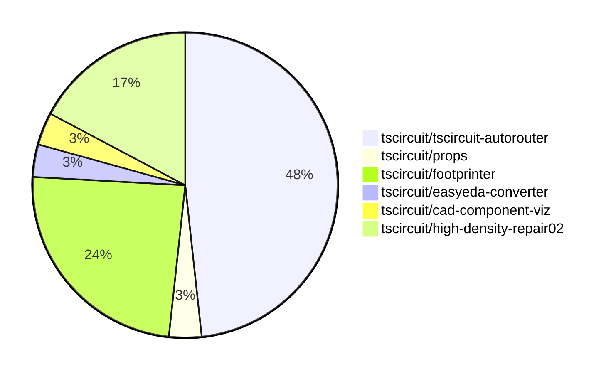

# Contribution Overview 2026-04-07

The current week is shown below. There are 3 major sections:

- [Contributor Overview](#contributor-overview)
- [PRs by Repository](#prs-by-repository)
- [PRs by Contributor](#changes-by-contributor)
- [Scoring & Sponsorship Details](/docs/sponsorship-calculation-explanation.md)

## PRs by Repository

## Contributor Overview

| Contributor | 🐳 Major | 🐙 Minor | 🐌 Tiny | Score | ⭐ | Discussion Contributions |
|-------------|---------|---------|---------|-------|-----|--------------------------|
| [seveibar](#seveibar) | 3 | 2 | 3 | 20 | ⭐⭐ | 0🔹 0🔶 0💎 |
| [MustafaMulla29](#MustafaMulla29) | 1 | 1 | 5 | 11 | ⭐⭐ | 0🔹 0🔶 0💎 |
| [tscircuitbot](#tscircuitbot) | 0 | 0 | 7 | 7 | ⭐ | 0🔹 0🔶 0💎 |
| [AnasSarkiz](#AnasSarkiz) | 0 | 1 | 4 | 5.5 | ⭐ | 0🔹 0🔶 0💎 |
| [mohan-bee](#mohan-bee) | 1 | 0 | 0 | 4 | ⭐ | 0🔹 0🔶 0💎 |
| [Abse2001](#Abse2001) | 1 | 0 | 0 | 4 | ⭐ | 0🔹 0🔶 0💎 |

## Staff Pass Ratio (SPR)

| Contributor | Reviewed PRs | Rejections | Approvals | SPR |
|-------------|--------------|------------|-----------|-----|
| [MustafaMulla29](#MustafaMulla29) | 3 | 2 | 3 | 33.3% |
| [mohan-bee](#mohan-bee) | 2 | 1 | 1 | 50.0% |
| [Abse2001](#Abse2001) | 1 | 0 | 1 | 100.0% |

MustafaMulla29 SPR PRs (3)

- [#591](https://github.com/tscircuit/footprinter/pull/591) Update remaining courtyard geometry and add parity tests
- [#585](https://github.com/tscircuit/footprinter/pull/585) Use generic body-based courtyard for SON parity
- [#588](https://github.com/tscircuit/footprinter/pull/588) feat(vssop): switch to generic body-based courtyard

mohan-bee SPR PRs (2)

- [#374](https://github.com/tscircuit/easyeda-converter/pull/374) Preserve {NAME}  placeholder in generated silkscreen text
- [#26](https://github.com/tscircuit/circuit-json-to-tscircuit/pull/26) Fix source‑subcircuit imports by preserving connectivity and props

Abse2001 SPR PRs (1)

- [#71](https://github.com/tscircuit/circuit-json-to-step/pull/71) Add STEP styling pipeline with face-level color support and optimized style reuse

> Note: AI evaluates PRs and assigns 1-3 star ratings automatically. 4 and 5 star ratings require manual staff review.

### Discussion Contribution Legend

- 🔹 Normal Comments: Basic participation with minimal effort
- 🔶 Great Informative Comments: Thoughtful participation that adds value
- 💎 Incredible Comments: Exceptional participation with high-quality content

## Review Table

[reviews-received-hover]: ## "Number of reviews received for PRs for this contributor"
[approvals-received-hover]: ## "Number of approvals received for PRs this contributor authored"
[rejections-received-hover]: ## "Number of rejections received for PRs this contributor authored"
[prs-opened-hover]: ## "Number of PRs opened by this contributor"
[issues-created-hover]: ## "Number of issues created by this contributor"

| Contributor | Reviews Received | Approvals Received | Rejections Received | Approvals | Rejections Given | PRs Opened | PRs Merged | Issues Created |
|---|---|---|---|---|---|---|---|---|
| [Abse2001](#Abse2001) | 1 | 1 | 0 | 0 | 0 | 3 | 1 | 0 |
| [seveibar](#seveibar) | 2 | 0 | 0 | 9 | 3 | 16 | 8 | 0 |
| [MustafaMulla29](#MustafaMulla29) | 14 | 7 | 2 | 0 | 0 | 9 | 7 | 0 |
| [mohan-bee](#mohan-bee) | 3 | 1 | 1 | 0 | 0 | 2 | 1 | 0 |
| [techmannih2](#techmannih2) | 0 | 0 | 0 | 0 | 0 | 2 | 0 | 0 |
| [tscircuitbot](#tscircuitbot) | 0 | 0 | 0 | 0 | 0 | 7 | 7 | 0 |
| [0hmxbot](#0hmxbot) | 0 | 0 | 0 | 0 | 0 | 3 | 0 | 0 |
| [mitchellecm7](#mitchellecm7) | 0 | 0 | 0 | 0 | 0 | 2 | 0 | 0 |
| [Emanuelgm1998](#Emanuelgm1998) | 0 | 0 | 0 | 0 | 0 | 1 | 0 | 0 |
| [AnasSarkiz](#AnasSarkiz) | 1 | 1 | 0 | 0 | 0 | 7 | 5 | 0 |
| [ShiboSoftwareDev](#ShiboSoftwareDev) | 0 | 0 | 0 | 1 | 0 | 0 | 0 | 0 |

## Changes by Repository

### [tscircuit/tscircuit-autorouter](https://github.com/tscircuit/tscircuit-autorouter)

| PR # | Impact | Rating | Contributor | Description |
|------|--------|--------|-------------|-------------|
| [#842](https://github.com/tscircuit/tscircuit-autorouter/pull/842) | 🐳 Major | ⭐⭐⭐ | seveibar | This pull request introduces a new route stitching solver (MultipleHighDensityRouteStitchSolver3) and replaces the previous solver (MultipleHighDensityRouteStitchSolver) in the autorouting pipeline. It also includes various improvements to the TinyHyperGraph solvers, enhancing their performance and configurability. |
| [#834](https://github.com/tscircuit/tscircuit-autorouter/pull/834) | 🐳 Major | ⭐⭐⭐ | seveibar | Adds a max node ratio of 6 to the autorouting pipeline, improving routing efficiency by 1.4. |
| [#828](https://github.com/tscircuit/tscircuit-autorouter/pull/828) | 🐳 Major | ⭐⭐⭐ | seveibar | Reduces the maximum node dimension from 8 to 7 for the autorouting pipeline5, affecting how nodes are processed in routing algorithms. |
| [#835](https://github.com/tscircuit/tscircuit-autorouter/pull/835) | 🐙 Minor | ⭐⭐ | seveibar | Adds a SolverOptions type and modifies solver instantiation to allow for per-scenario solver tuning via an effort value, while maintaining existing runTask behavior. |

🐌 Tiny Contributions (10)

| PR # | Impact | Contributor | Description |
|------|--------|-------------|-------------|
| [#840](https://github.com/tscircuit/tscircuit-autorouter/pull/840) | 🐌 Tiny | seveibar | Adds an optional isCopperPour flag to the Obstacle type in SimpleRouteJson and updates the README to document this new flag. |
| [#836](https://github.com/tscircuit/tscircuit-autorouter/pull/836) | 🐌 Tiny | seveibar | Sets the autorouting debugging fixture to use Pipeline 4 by default when no pipeline is stored in localStorage. |
| [#830](https://github.com/tscircuit/tscircuit-autorouter/pull/830) | 🐌 Tiny | seveibar | Adds a fixture and regression test for reproducing and debugging autorouting bug report 569cfe9b-1c74-4e59-b360-32ccaacfb0be, including an SVG snapshot for visualization comparison. |
| [#847](https://github.com/tscircuit/tscircuit-autorouter/pull/847) | 🐌 Tiny | tscircuitbot | Automated package update |
| [#844](https://github.com/tscircuit/tscircuit-autorouter/pull/844) | 🐌 Tiny | tscircuitbot | Automated package update |
| [#839](https://github.com/tscircuit/tscircuit-autorouter/pull/839) | 🐌 Tiny | tscircuitbot | Automated package update |
| [#838](https://github.com/tscircuit/tscircuit-autorouter/pull/838) | 🐌 Tiny | tscircuitbot | Automated package update |
| [#837](https://github.com/tscircuit/tscircuit-autorouter/pull/837) | 🐌 Tiny | tscircuitbot | Automated package update |
| [#832](https://github.com/tscircuit/tscircuit-autorouter/pull/832) | 🐌 Tiny | tscircuitbot | Automated package update |
| [#829](https://github.com/tscircuit/tscircuit-autorouter/pull/829) | 🐌 Tiny | tscircuitbot | Automated package update |

### [tscircuit/props](https://github.com/tscircuit/props)

| PR # | Impact | Rating | Contributor | Description |
|------|--------|--------|-------------|-------------|
| [#628](https://github.com/tscircuit/props/pull/628) | 🐙 Minor | ⭐⭐ | seveibar | Add an optional unbroken boolean to CopperPourProps to indicate that the copper pour should remain unbroken during processing or rendering. |

### [tscircuit/footprinter](https://github.com/tscircuit/footprinter)

| PR # | Impact | Rating | Contributor | Description |
|------|--------|--------|-------------|-------------|
| [#588](https://github.com/tscircuit/footprinter/pull/588) | 🐳 Major | ⭐⭐⭐ | MustafaMulla29 | Switches the courtyard representation for VSSOP components from a rectangular format to a generic body-based outline format, enhancing the accuracy of component layout. |
| [#585](https://github.com/tscircuit/footprinter/pull/585) | 🐙 Minor | ⭐⭐ | MustafaMulla29 | Changes the courtyard representation for SON components from a rectangular format to a more generic outline format, improving the accuracy of component layout in PCB designs. |

🐌 Tiny Contributions (5)

| PR # | Impact | Contributor | Description |
|------|--------|-------------|-------------|
| [#590](https://github.com/tscircuit/footprinter/pull/590) | 🐌 Tiny | MustafaMulla29 | Fixes courtyard dimensions for JST, SOT, TO220, VSON, and electrolytic components to ensure proper layout and spacing in PCB designs. |
| [#589](https://github.com/tscircuit/footprinter/pull/589) | 🐌 Tiny | MustafaMulla29 | Fixes courtyard definitions for BGA, DIP, SOD923, SOT223, and axial components to ensure accurate PCB layout. |
| [#586](https://github.com/tscircuit/footprinter/pull/586) | 🐌 Tiny | MustafaMulla29 | Changes the SOP8 footprint to use a generic stepped courtyard outline instead of a rectangular courtyard, improving the accuracy of the footprint representation. |
| [#587](https://github.com/tscircuit/footprinter/pull/587) | 🐌 Tiny | MustafaMulla29 | Updates the TSSOP courtyard definition to use a generic body-based stepped outline instead of a rectangular courtyard, improving the accuracy of component footprints. |
| [#584](https://github.com/tscircuit/footprinter/pull/584) | 🐌 Tiny | MustafaMulla29 | Fixes courtyard generation for quad components to utilize a body-based approach, improving accuracy in PCB layout. |

### [tscircuit/easyeda-converter](https://github.com/tscircuit/easyeda-converter)

| PR # | Impact | Rating | Contributor | Description |
|------|--------|--------|-------------|-------------|
| [#374](https://github.com/tscircuit/easyeda-converter/pull/374) | 🐳 Major | ⭐⭐⭐ | mohan-bee | this PR fixes easyeda generated chip footprints to preserve the NAME silkscreen placeholder instead of converting it to props.name, preventing runtime text required errors in the editor. |

### [tscircuit/cad-component-viz](https://github.com/tscircuit/cad-component-viz)

| PR # | Impact | Rating | Contributor | Description |
|------|--------|--------|-------------|-------------|
| [#5](https://github.com/tscircuit/cad-component-viz/pull/5) | 🐳 Major | ⭐⭐⭐ | Abse2001 | Adds a drag-and-drop interface for loading CAD models on the landing page and enhances the viewer model loading workflow. |

### [tscircuit/high-density-repair02](https://github.com/tscircuit/high-density-repair02)

| PR # | Impact | Rating | Contributor | Description |
|------|--------|--------|-------------|-------------|
| [#35](https://github.com/tscircuit/high-density-repair02/pull/35) | 🐙 Minor | ⭐⭐ | AnasSarkiz | Adds detailed benchmark reporting with a full metrics breakdown and a comparison of performance deltas between the current PR and the main branch. |

🐌 Tiny Contributions (4)

| PR # | Impact | Contributor | Description |
|------|--------|-------------|-------------|
| [#34](https://github.com/tscircuit/high-density-repair02/pull/34) | 🐌 Tiny | AnasSarkiz | Updates the README to correct the description of the project by adding A at the beginning of the project description. |
| [#33](https://github.com/tscircuit/high-density-repair02/pull/33) | 🐌 Tiny | AnasSarkiz | This pull request introduces a new feature that replaces noisy logs in the benchmark workflow with actionable summary tables. The changes include modifications to the benchmark workflow files to enhance the output format, making it easier to interpret benchmark results. Additionally, a new JSON file is created to store benchmark results, which can be referenced in the summary tables. |
| [#31](https://github.com/tscircuit/high-density-repair02/pull/31) | 🐌 Tiny | AnasSarkiz | Adds a comprehensive GitHub Actions workflow for benchmarking that triggers on pull requests, allowing for argument parsing and automated reporting of results. |
| [#30](https://github.com/tscircuit/high-density-repair02/pull/30) | 🐌 Tiny | AnasSarkiz | Adds a new React component that provides fixtures for circuit and bug report cases, allowing users to load and debug various asset problems. |

## Changes by Contributor

### [seveibar](https://github.com/seveibar)

| PRs # | Impact | Rating | Description |
|------|--------|--------|-------------|
| [#842](https://github.com/tscircuit/tscircuit-autorouter/pull/842) | 🐳 Major | ⭐⭐⭐ | This pull request introduces a new route stitching solver (MultipleHighDensityRouteStitchSolver3) and replaces the previous solver (MultipleHighDensityRouteStitchSolver) in the autorouting pipeline. It also includes various improvements to the TinyHyperGraph solvers, enhancing their performance and configurability. |
| [#834](https://github.com/tscircuit/tscircuit-autorouter/pull/834) | 🐳 Major | ⭐⭐⭐ | Adds a max node ratio of 6 to the autorouting pipeline, improving routing efficiency by 1.4. |
| [#828](https://github.com/tscircuit/tscircuit-autorouter/pull/828) | 🐳 Major | ⭐⭐⭐ | Reduces the maximum node dimension from 8 to 7 for the autorouting pipeline5, affecting how nodes are processed in routing algorithms. |
| [#628](https://github.com/tscircuit/props/pull/628) | 🐙 Minor | ⭐⭐ | Add an optional unbroken boolean to CopperPourProps to indicate that the copper pour should remain unbroken during processing or rendering. |
| [#835](https://github.com/tscircuit/tscircuit-autorouter/pull/835) | 🐙 Minor | ⭐⭐ | Adds a SolverOptions type and modifies solver instantiation to allow for per-scenario solver tuning via an effort value, while maintaining existing runTask behavior. |

🐌 Tiny Contributions (3)

| PR # | Impact | Description |
|------|--------|-------------|
| [#840](https://github.com/tscircuit/tscircuit-autorouter/pull/840) | 🐌 Tiny | Adds an optional isCopperPour flag to the Obstacle type in SimpleRouteJson and updates the README to document this new flag. |
| [#836](https://github.com/tscircuit/tscircuit-autorouter/pull/836) | 🐌 Tiny | Sets the autorouting debugging fixture to use Pipeline 4 by default when no pipeline is stored in localStorage. |
| [#830](https://github.com/tscircuit/tscircuit-autorouter/pull/830) | 🐌 Tiny | Adds a fixture and regression test for reproducing and debugging autorouting bug report 569cfe9b-1c74-4e59-b360-32ccaacfb0be, including an SVG snapshot for visualization comparison. |

### [MustafaMulla29](https://github.com/MustafaMulla29)

| PRs # | Impact | Rating | Description |
|------|--------|--------|-------------|
| [#588](https://github.com/tscircuit/footprinter/pull/588) | 🐳 Major | ⭐⭐⭐ | Switches the courtyard representation for VSSOP components from a rectangular format to a generic body-based outline format, enhancing the accuracy of component layout. |
| [#585](https://github.com/tscircuit/footprinter/pull/585) | 🐙 Minor | ⭐⭐ | Changes the courtyard representation for SON components from a rectangular format to a more generic outline format, improving the accuracy of component layout in PCB designs. |

🐌 Tiny Contributions (5)

| PR # | Impact | Description |
|------|--------|-------------|
| [#590](https://github.com/tscircuit/footprinter/pull/590) | 🐌 Tiny | Fixes courtyard dimensions for JST, SOT, TO220, VSON, and electrolytic components to ensure proper layout and spacing in PCB designs. |
| [#589](https://github.com/tscircuit/footprinter/pull/589) | 🐌 Tiny | Fixes courtyard definitions for BGA, DIP, SOD923, SOT223, and axial components to ensure accurate PCB layout. |
| [#586](https://github.com/tscircuit/footprinter/pull/586) | 🐌 Tiny | Changes the SOP8 footprint to use a generic stepped courtyard outline instead of a rectangular courtyard, improving the accuracy of the footprint representation. |
| [#587](https://github.com/tscircuit/footprinter/pull/587) | 🐌 Tiny | Updates the TSSOP courtyard definition to use a generic body-based stepped outline instead of a rectangular courtyard, improving the accuracy of component footprints. |
| [#584](https://github.com/tscircuit/footprinter/pull/584) | 🐌 Tiny | Fixes courtyard generation for quad components to utilize a body-based approach, improving accuracy in PCB layout. |

### [mohan-bee](https://github.com/mohan-bee)

| PRs # | Impact | Rating | Description |
|------|--------|--------|-------------|
| [#374](https://github.com/tscircuit/easyeda-converter/pull/374) | 🐳 Major | ⭐⭐⭐ | this PR fixes easyeda generated chip footprints to preserve the NAME silkscreen placeholder instead of converting it to props.name, preventing runtime text required errors in the editor. |

### [tscircuitbot](https://github.com/tscircuitbot)

🐌 Tiny Contributions (7)

| PR # | Impact | Description |
|------|--------|-------------|
| [#847](https://github.com/tscircuit/tscircuit-autorouter/pull/847) | 🐌 Tiny | Automated package update |
| [#844](https://github.com/tscircuit/tscircuit-autorouter/pull/844) | 🐌 Tiny | Automated package update |
| [#839](https://github.com/tscircuit/tscircuit-autorouter/pull/839) | 🐌 Tiny | Automated package update |
| [#838](https://github.com/tscircuit/tscircuit-autorouter/pull/838) | 🐌 Tiny | Automated package update |
| [#837](https://github.com/tscircuit/tscircuit-autorouter/pull/837) | 🐌 Tiny | Automated package update |
| [#832](https://github.com/tscircuit/tscircuit-autorouter/pull/832) | 🐌 Tiny | Automated package update |
| [#829](https://github.com/tscircuit/tscircuit-autorouter/pull/829) | 🐌 Tiny | Automated package update |

### [Abse2001](https://github.com/Abse2001)

| PRs # | Impact | Rating | Description |
|------|--------|--------|-------------|
| [#5](https://github.com/tscircuit/cad-component-viz/pull/5) | 🐳 Major | ⭐⭐⭐ | Adds a drag-and-drop interface for loading CAD models on the landing page and enhances the viewer model loading workflow. |

### [AnasSarkiz](https://github.com/AnasSarkiz)

| PRs # | Impact | Rating | Description |
|------|--------|--------|-------------|
| [#35](https://github.com/tscircuit/high-density-repair02/pull/35) | 🐙 Minor | ⭐⭐ | Adds detailed benchmark reporting with a full metrics breakdown and a comparison of performance deltas between the current PR and the main branch. |

🐌 Tiny Contributions (4)

| PR # | Impact | Description |
|------|--------|-------------|
| [#34](https://github.com/tscircuit/high-density-repair02/pull/34) | 🐌 Tiny | Updates the README to correct the description of the project by adding A at the beginning of the project description. |
| [#33](https://github.com/tscircuit/high-density-repair02/pull/33) | 🐌 Tiny | This pull request introduces a new feature that replaces noisy logs in the benchmark workflow with actionable summary tables. The changes include modifications to the benchmark workflow files to enhance the output format, making it easier to interpret benchmark results. Additionally, a new JSON file is created to store benchmark results, which can be referenced in the summary tables. |
| [#31](https://github.com/tscircuit/high-density-repair02/pull/31) | 🐌 Tiny | Adds a comprehensive GitHub Actions workflow for benchmarking that triggers on pull requests, allowing for argument parsing and automated reporting of results. |
| [#30](https://github.com/tscircuit/high-density-repair02/pull/30) | 🐌 Tiny | Adds a new React component that provides fixtures for circuit and bug report cases, allowing users to load and debug various asset problems. |

## Repository Owners

| Repository | Codeowners |
|------------|------------|
| [builder](https://github.com/tscircuit/builder/blob/main/.github/CODEOWNERS) | [seveibar](https://github.com/seveibar)
| [pcb-viewer](https://github.com/tscircuit/pcb-viewer/blob/main/.github/CODEOWNERS) | [seveibar](https://github.com/seveibar), [ShiboSoftwareDev](https://github.com/ShiboSoftwareDev), [Abse2001](https://github.com/Abse2001)
| [footprints-old](https://github.com/tscircuit/footprints-old/blob/main/.github/CODEOWNERS) | [seveibar](https://github.com/seveibar)
| [footprinter](https://github.com/tscircuit/footprinter/blob/main/.github/CODEOWNERS) | [seveibar](https://github.com/seveibar), [techmannih](https://github.com/techmannih)
| [3d-viewer](https://github.com/tscircuit/3d-viewer/blob/main/.github/CODEOWNERS) | [ShiboSoftwareDev](https://github.com/ShiboSoftwareDev), [Abse2001](https://github.com/Abse2001)
| [winterspec](https://github.com/tscircuit/winterspec/blob/main/.github/CODEOWNERS) | [seveibar](https://github.com/seveibar), [ShiboSoftwareDev](https://github.com/ShiboSoftwareDev)
| [jscad-electronics](https://github.com/tscircuit/jscad-electronics/blob/main/.github/CODEOWNERS) | [seveibar](https://github.com/seveibar), [techmannih](https://github.com/techmannih), [ShiboSoftwareDev](https://github.com/ShiboSoftwareDev), [anas-sarkez](https://github.com/anas-sarkez)
| [circuit-to-svg](https://github.com/tscircuit/circuit-to-svg/blob/main/.github/CODEOWNERS) | [imrishabh18](https://github.com/imrishabh18)
| [schematic-symbols](https://github.com/tscircuit/schematic-symbols/blob/main/.github/CODEOWNERS) | [seveibar](https://github.com/seveibar), [imrishabh18](https://github.com/imrishabh18), [techmannih](https://github.com/techmannih)
| [circuit-json-to-gerber](https://github.com/tscircuit/circuit-json-to-gerber/blob/main/.github/CODEOWNERS) | [seveibar](https://github.com/seveibar), [ShiboSoftwareDev](https://github.com/ShiboSoftwareDev)
| [tscircuit.com](https://github.com/tscircuit/tscircuit.com/blob/main/.github/CODEOWNERS) | [seveibar](https://github.com/seveibar), [imrishabh18](https://github.com/imrishabh18)
| [issue-roulette](https://github.com/tscircuit/issue-roulette/blob/main/.github/CODEOWNERS) | [Anshgrover23](https://github.com/Anshgrover23)
| [sparkfun-boards](https://github.com/tscircuit/sparkfun-boards/blob/main/.github/CODEOWNERS) | [ShiboSoftwareDev](https://github.com/ShiboSoftwareDev), [Abse2001](https://github.com/Abse2001), [MustafaMulla29](https://github.com/MustafaMulla29), [Anshgrover23](https://github.com/Anshgrover23), [techmannih](https://github.com/techmannih)
| [schematic-corpus](https://github.com/tscircuit/schematic-corpus/blob/main/.github/CODEOWNERS) | [Abse2001](https://github.com/Abse2001)
| [copper-pour-solver](https://github.com/tscircuit/copper-pour-solver/blob/main/.github/CODEOWNERS) | [seveibar](https://github.com/seveibar), [ShiboSoftwareDev](https://github.com/ShiboSoftwareDev)
| [common](https://github.com/tscircuit/common/blob/main/.github/CODEOWNERS) | [seveibar](https://github.com/seveibar), [Abse2001](https://github.com/Abse2001)
| [circuit-to-canvas](https://github.com/tscircuit/circuit-to-canvas/blob/main/.github/CODEOWNERS) | [ShiboSoftwareDev](https://github.com/ShiboSoftwareDev), [Abse2001](https://github.com/Abse2001), [techmannih](https://github.com/techmannih)
| [circuit-json-to-lbrn](https://github.com/tscircuit/circuit-json-to-lbrn/blob/main/.github/CODEOWNERS) | [AnasSarkiz](https://github.com/AnasSarkiz)
| [pcbburn.com](https://github.com/tscircuit/pcbburn.com/blob/main/.github/CODEOWNERS) | [AnasSarkiz](https://github.com/AnasSarkiz)

## Repositories by Owner

| User | Repo |
|------|------|
| [seveibar](https://github.com/seveibar) | [builder](https://github.com/tscircuit/builder/blob/main/.github/CODEOWNERS) |
|  | [pcb-viewer](https://github.com/tscircuit/pcb-viewer/blob/main/.github/CODEOWNERS) |
|  | [footprints-old](https://github.com/tscircuit/footprints-old/blob/main/.github/CODEOWNERS) |
|  | [footprinter](https://github.com/tscircuit/footprinter/blob/main/.github/CODEOWNERS) |
|  | [winterspec](https://github.com/tscircuit/winterspec/blob/main/.github/CODEOWNERS) |
|  | [jscad-electronics](https://github.com/tscircuit/jscad-electronics/blob/main/.github/CODEOWNERS) |
|  | [schematic-symbols](https://github.com/tscircuit/schematic-symbols/blob/main/.github/CODEOWNERS) |
|  | [circuit-json-to-gerber](https://github.com/tscircuit/circuit-json-to-gerber/blob/main/.github/CODEOWNERS) |
|  | [tscircuit.com](https://github.com/tscircuit/tscircuit.com/blob/main/.github/CODEOWNERS) |
|  | [copper-pour-solver](https://github.com/tscircuit/copper-pour-solver/blob/main/.github/CODEOWNERS) |
|  | [common](https://github.com/tscircuit/common/blob/main/.github/CODEOWNERS) |
| [ShiboSoftwareDev](https://github.com/ShiboSoftwareDev) | [pcb-viewer](https://github.com/tscircuit/pcb-viewer/blob/main/.github/CODEOWNERS) |
|  | [3d-viewer](https://github.com/tscircuit/3d-viewer/blob/main/.github/CODEOWNERS) |
|  | [winterspec](https://github.com/tscircuit/winterspec/blob/main/.github/CODEOWNERS) |
|  | [jscad-electronics](https://github.com/tscircuit/jscad-electronics/blob/main/.github/CODEOWNERS) |
|  | [circuit-json-to-gerber](https://github.com/tscircuit/circuit-json-to-gerber/blob/main/.github/CODEOWNERS) |
|  | [sparkfun-boards](https://github.com/tscircuit/sparkfun-boards/blob/main/.github/CODEOWNERS) |
|  | [copper-pour-solver](https://github.com/tscircuit/copper-pour-solver/blob/main/.github/CODEOWNERS) |
|  | [circuit-to-canvas](https://github.com/tscircuit/circuit-to-canvas/blob/main/.github/CODEOWNERS) |
| [Abse2001](https://github.com/Abse2001) | [pcb-viewer](https://github.com/tscircuit/pcb-viewer/blob/main/.github/CODEOWNERS) |
|  | [3d-viewer](https://github.com/tscircuit/3d-viewer/blob/main/.github/CODEOWNERS) |
|  | [sparkfun-boards](https://github.com/tscircuit/sparkfun-boards/blob/main/.github/CODEOWNERS) |
|  | [schematic-corpus](https://github.com/tscircuit/schematic-corpus/blob/main/.github/CODEOWNERS) |
|  | [common](https://github.com/tscircuit/common/blob/main/.github/CODEOWNERS) |
|  | [circuit-to-canvas](https://github.com/tscircuit/circuit-to-canvas/blob/main/.github/CODEOWNERS) |
| [techmannih](https://github.com/techmannih) | [footprinter](https://github.com/tscircuit/footprinter/blob/main/.github/CODEOWNERS) |
|  | [jscad-electronics](https://github.com/tscircuit/jscad-electronics/blob/main/.github/CODEOWNERS) |
|  | [schematic-symbols](https://github.com/tscircuit/schematic-symbols/blob/main/.github/CODEOWNERS) |
|  | [sparkfun-boards](https://github.com/tscircuit/sparkfun-boards/blob/main/.github/CODEOWNERS) |
|  | [circuit-to-canvas](https://github.com/tscircuit/circuit-to-canvas/blob/main/.github/CODEOWNERS) |
| [anas-sarkez](https://github.com/anas-sarkez) | [jscad-electronics](https://github.com/tscircuit/jscad-electronics/blob/main/.github/CODEOWNERS) |
| [imrishabh18](https://github.com/imrishabh18) | [circuit-to-svg](https://github.com/tscircuit/circuit-to-svg/blob/main/.github/CODEOWNERS) |
|  | [schematic-symbols](https://github.com/tscircuit/schematic-symbols/blob/main/.github/CODEOWNERS) |
|  | [tscircuit.com](https://github.com/tscircuit/tscircuit.com/blob/main/.github/CODEOWNERS) |
| [Anshgrover23](https://github.com/Anshgrover23) | [issue-roulette](https://github.com/tscircuit/issue-roulette/blob/main/.github/CODEOWNERS) |
|  | [sparkfun-boards](https://github.com/tscircuit/sparkfun-boards/blob/main/.github/CODEOWNERS) |
| [MustafaMulla29](https://github.com/MustafaMulla29) | [sparkfun-boards](https://github.com/tscircuit/sparkfun-boards/blob/main/.github/CODEOWNERS) |
| [AnasSarkiz](https://github.com/AnasSarkiz) | [circuit-json-to-lbrn](https://github.com/tscircuit/circuit-json-to-lbrn/blob/main/.github/CODEOWNERS) |
|  | [pcbburn.com](https://github.com/tscircuit/pcbburn.com/blob/main/.github/CODEOWNERS) |

