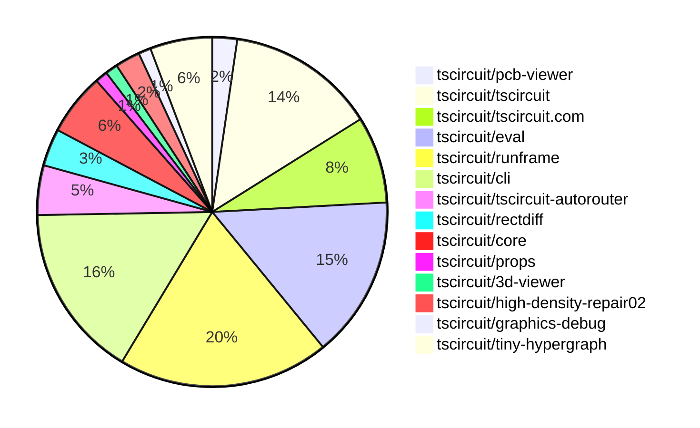

# Contribution Overview 2026-04-14

The current week is shown below. There are 3 major sections:

- [Contributor Overview](#contributor-overview)
- [PRs by Repository](#prs-by-repository)
- [PRs by Contributor](#changes-by-contributor)
- [Scoring & Sponsorship Details](/docs/sponsorship-calculation-explanation.md)

## PRs by Repository

## Contributor Overview

| Contributor | 🐳 Major | 🐙 Minor | 🐌 Tiny | Score | ⭐ | Discussion Contributions |
|-------------|---------|---------|---------|-------|-----|--------------------------|
| [seveibar](#seveibar) | 4 | 2 | 1 | 22 | ⭐⭐ | 0🔹 0🔶 0💎 |
| [ShiboSoftwareDev](#ShiboSoftwareDev) | 4 | 0 | 1 | 18 | ⭐⭐ | 0🔹 0🔶 0💎 |
| [tscircuitbot](#tscircuitbot) | 0 | 0 | 66 | 13 | ⭐⭐ | 0🔹 0🔶 0💎 |
| [techmannih](#techmannih) | 1 | 1 | 0 | 6 | ⭐ | 0🔹 0🔶 0💎 |
| [0hmX](#0hmX) | 1 | 0 | 1 | 5 | ⭐ | 0🔹 0🔶 0💎 |
| [AnasSarkiz](#AnasSarkiz) | 1 | 0 | 0 | 4 | ⭐ | 0🔹 0🔶 0💎 |
| [MustafaMulla29](#MustafaMulla29) | 0 | 1 | 1 | 3 |  | 0🔹 0🔶 0💎 |
| [imrishabh18](#imrishabh18) | 0 | 1 | 0 | 2 |  | 0🔹 0🔶 0💎 |
| [rushabhcodes](#rushabhcodes) | 0 | 0 | 1 | 1 |  | 0🔹 0🔶 0💎 |

## Staff Pass Ratio (SPR)

| Contributor | Reviewed PRs | Rejections | Approvals | SPR |
|-------------|--------------|------------|-----------|-----|
| [ShiboSoftwareDev](#ShiboSoftwareDev) | 3 | 0 | 3 | 100.0% |
| [techmannih](#techmannih) | 2 | 0 | 2 | 100.0% |
| [MustafaMulla29](#MustafaMulla29) | 2 | 0 | 2 | 100.0% |
| [Abse2001](#Abse2001) | 1 | 1 | 0 | 0.0% |

ShiboSoftwareDev SPR PRs (3)

- [#2140](https://github.com/tscircuit/core/pull/2140) Include vias in obstacle connectivity
- [#2139](https://github.com/tscircuit/core/pull/2139) Add phased local autorouting by routingPhaseIndex
- [#2132](https://github.com/tscircuit/core/pull/2132) Deduplicate logical ports from composite footprint copper

techmannih SPR PRs (2)

- [#737](https://github.com/tscircuit/pcb-viewer/pull/737) Fix inner-layer copper pour rendering
- [#2141](https://github.com/tscircuit/core/pull/2141) Support rotated pill-hole-with-rect-pad plated hole

MustafaMulla29 SPR PRs (2)

- [#631](https://github.com/tscircuit/props/pull/631) Optional platformFetch for fetchPartCircuitJson
- [#23](https://github.com/tscircuit/parts-engine/pull/23) chore: bundle easyeda into parts-engine dist

Abse2001 SPR PRs (1)

- [#75](https://github.com/tscircuit/circuit-json-to-step/pull/75) Introduce dynamic module registry with fallback import, validation, and test-time injection

> Note: AI evaluates PRs and assigns 1-3 star ratings automatically. 4 and 5 star ratings require manual staff review.

### Discussion Contribution Legend

- 🔹 Normal Comments: Basic participation with minimal effort
- 🔶 Great Informative Comments: Thoughtful participation that adds value
- 💎 Incredible Comments: Exceptional participation with high-quality content

## Review Table

[reviews-received-hover]: ## "Number of reviews received for PRs for this contributor"
[approvals-received-hover]: ## "Number of approvals received for PRs this contributor authored"
[rejections-received-hover]: ## "Number of rejections received for PRs this contributor authored"
[prs-opened-hover]: ## "Number of PRs opened by this contributor"
[issues-created-hover]: ## "Number of issues created by this contributor"

| Contributor | Reviews Received | Approvals Received | Rejections Received | Approvals | Rejections Given | PRs Opened | PRs Merged | Issues Created |
|---|---|---|---|---|---|---|---|---|
| [lyfher](#lyfher) | 0 | 0 | 0 | 0 | 0 | 3 | 0 | 0 |
| [LuSrodri](#LuSrodri) | 0 | 0 | 0 | 0 | 0 | 4 | 0 | 0 |
| [Abse2001](#Abse2001) | 6 | 0 | 1 | 2 | 0 | 2 | 0 | 0 |
| [seveibar](#seveibar) | 0 | 0 | 0 | 9 | 1 | 8 | 7 | 0 |
| [tscircuitbot](#tscircuitbot) | 0 | 0 | 0 | 0 | 0 | 91 | 66 | 0 |
| [techmannih](#techmannih) | 3 | 3 | 0 | 0 | 0 | 2 | 2 | 0 |
| [MustafaMulla29](#MustafaMulla29) | 4 | 2 | 0 | 0 | 0 | 11 | 3 | 0 |
| [Kabi10](#Kabi10) | 0 | 0 | 0 | 0 | 0 | 2 | 0 | 0 |
| [rushabhcodes](#rushabhcodes) | 3 | 2 | 0 | 0 | 0 | 1 | 1 | 0 |
| [imrishabh18](#imrishabh18) | 0 | 0 | 0 | 0 | 0 | 1 | 1 | 0 |
| [ShiboSoftwareDev](#ShiboSoftwareDev) | 4 | 4 | 0 | 1 | 0 | 7 | 5 | 0 |
| [mohan-bee](#mohan-bee) | 0 | 0 | 0 | 0 | 0 | 1 | 0 | 0 |
| [0hmX](#0hmX) | 0 | 0 | 0 | 0 | 0 | 6 | 2 | 0 |
| [shanimaury89-art](#shanimaury89-art) | 0 | 0 | 0 | 0 | 0 | 1 | 0 | 0 |
| [liufang88789-ui](#liufang88789-ui) | 0 | 0 | 0 | 0 | 0 | 1 | 0 | 0 |
| [AnasSarkiz](#AnasSarkiz) | 1 | 1 | 0 | 0 | 0 | 2 | 1 | 0 |

## Changes by Repository

### [tscircuit/pcb-viewer](https://github.com/tscircuit/pcb-viewer)

| PR # | Impact | Rating | Contributor | Description |
|------|--------|--------|-------------|-------------|
| [#737](https://github.com/tscircuit/pcb-viewer/pull/737) | 🐳 Major | ⭐⭐⭐ | techmannih | test :https:pcb-viewer-1oocgd3ju-tscircuit.vercel.app?fixture7B22path223A22src2Fexamples2F20262Frepros2Finner-layer-copper-pours.fixture.tsx227D https:pcb-viewer-1oocgd3ju-tscircuit.vercel.app?fixture7B22path223A22src2Fexamples2F20262Frepros2Foverlapping-inner-layer-copper-pours.fixture.tsx227D render copper pours through the shared copper layer loop used by other copper elements while tracespadstext already looped across top, bottom, and inner1-inner6 remove the duplicate topbottom-only copper pour draw pass add an 8-layer repro fixture covering top, inner1-inner6, and bottom |

🐌 Tiny Contributions (1)

| PR # | Impact | Contributor | Description |
|------|--------|-------------|-------------|
| [#740](https://github.com/tscircuit/pcb-viewer/pull/740) | 🐌 Tiny | tscircuitbot | Automated package update |

### [tscircuit/tscircuit](https://github.com/tscircuit/tscircuit)

🐌 Tiny Contributions (12)

| PR # | Impact | Contributor | Description |
|------|--------|-------------|-------------|
| [#2915](https://github.com/tscircuit/tscircuit/pull/2915) | 🐌 Tiny | tscircuitbot | Automated package update |
| [#2914](https://github.com/tscircuit/tscircuit/pull/2914) | 🐌 Tiny | tscircuitbot | Automated package update |
| [#2911](https://github.com/tscircuit/tscircuit/pull/2911) | 🐌 Tiny | tscircuitbot | Automated package update |
| [#2910](https://github.com/tscircuit/tscircuit/pull/2910) | 🐌 Tiny | tscircuitbot | Automated package update |
| [#2909](https://github.com/tscircuit/tscircuit/pull/2909) | 🐌 Tiny | tscircuitbot | Updates the package version from 0.0.1630 to 0.0.1631 in package.json |
| [#2908](https://github.com/tscircuit/tscircuit/pull/2908) | 🐌 Tiny | tscircuitbot | Updates the version of several packages in the project, including tscircuitcli, tscircuitcore, and tscircuiteval. |
| [#2906](https://github.com/tscircuit/tscircuit/pull/2906) | 🐌 Tiny | tscircuitbot | Automated package update |
| [#2905](https://github.com/tscircuit/tscircuit/pull/2905) | 🐌 Tiny | tscircuitbot | Automated package update |
| [#2904](https://github.com/tscircuit/tscircuit/pull/2904) | 🐌 Tiny | tscircuitbot | Automated package update |
| [#2903](https://github.com/tscircuit/tscircuit/pull/2903) | 🐌 Tiny | tscircuitbot | Updates the tscircuitcli package and other related dependencies to their latest versions. |
| [#2902](https://github.com/tscircuit/tscircuit/pull/2902) | 🐌 Tiny | tscircuitbot | Automated package update |
| [#2901](https://github.com/tscircuit/tscircuit/pull/2901) | 🐌 Tiny | tscircuitbot | Updates the tscircuitcli package from version 0.1.1227 to 0.1.1228 and the tscircuitrunframe package from version 0.0.1816 to 0.0.1817 in the package.json file. |

### [tscircuit/tscircuit.com](https://github.com/tscircuit/tscircuit.com)

🐌 Tiny Contributions (7)

| PR # | Impact | Contributor | Description |
|------|--------|-------------|-------------|
| [#3164](https://github.com/tscircuit/tscircuit.com/pull/3164) | 🐌 Tiny | tscircuitbot | Automated package update |
| [#3162](https://github.com/tscircuit/tscircuit.com/pull/3162) | 🐌 Tiny | tscircuitbot | Automated package update |
| [#3160](https://github.com/tscircuit/tscircuit.com/pull/3160) | 🐌 Tiny | tscircuitbot | Updates the tscircuiteval package from version 0.0.754 to 0.0.755 |
| [#3158](https://github.com/tscircuit/tscircuit.com/pull/3158) | 🐌 Tiny | tscircuitbot | Automated package update |
| [#3153](https://github.com/tscircuit/tscircuit.com/pull/3153) | 🐌 Tiny | tscircuitbot | Updates the tscircuiteval package to version 0.0.753 |
| [#3152](https://github.com/tscircuit/tscircuit.com/pull/3152) | 🐌 Tiny | tscircuitbot | Updates the version of the tscircuiteval package from 0.0.751 to 0.0.752 in package.json |
| [#3150](https://github.com/tscircuit/tscircuit.com/pull/3150) | 🐌 Tiny | tscircuitbot | Updates the tscircuiteval package from version 0.0.750 to 0.0.751 |

### [tscircuit/eval](https://github.com/tscircuit/eval)

🐌 Tiny Contributions (13)

| PR # | Impact | Contributor | Description |
|------|--------|-------------|-------------|
| [#2411](https://github.com/tscircuit/eval/pull/2411) | 🐌 Tiny | tscircuitbot | Automated package update |
| [#2408](https://github.com/tscircuit/eval/pull/2408) | 🐌 Tiny | tscircuitbot | Automated package update |
| [#2405](https://github.com/tscircuit/eval/pull/2405) | 🐌 Tiny | tscircuitbot | Automated package update |
| [#2404](https://github.com/tscircuit/eval/pull/2404) | 🐌 Tiny | tscircuitbot | Updates the version of the tscircuitcore package from 0.0.1164 to 0.0.1165 in package.json |
| [#2402](https://github.com/tscircuit/eval/pull/2402) | 🐌 Tiny | tscircuitbot | Automated package update |
| [#2401](https://github.com/tscircuit/eval/pull/2401) | 🐌 Tiny | tscircuitbot | Automated package update |
| [#2399](https://github.com/tscircuit/eval/pull/2399) | 🐌 Tiny | tscircuitbot | Automated package update |
| [#2397](https://github.com/tscircuit/eval/pull/2397) | 🐌 Tiny | tscircuitbot | Updates the version of the tscircuitcore package from 0.0.1162 to 0.0.1163 in package.json |
| [#2398](https://github.com/tscircuit/eval/pull/2398) | 🐌 Tiny | tscircuitbot | Automated package update |
| [#2395](https://github.com/tscircuit/eval/pull/2395) | 🐌 Tiny | tscircuitbot | Updates the version of the tscircuitcore package from 0.0.1161 to 0.0.1162 in package.json |
| [#2393](https://github.com/tscircuit/eval/pull/2393) | 🐌 Tiny | tscircuitbot | Automated package update |
| [#2392](https://github.com/tscircuit/eval/pull/2392) | 🐌 Tiny | tscircuitbot | Automated package update |
| [#2407](https://github.com/tscircuit/eval/pull/2407) | 🐌 Tiny | MustafaMulla29 | Removes easyeda from the noExternal configuration in multiple build configuration files. |

### [tscircuit/runframe](https://github.com/tscircuit/runframe)

🐌 Tiny Contributions (17)

| PR # | Impact | Contributor | Description |
|------|--------|-------------|-------------|
| [#3123](https://github.com/tscircuit/runframe/pull/3123) | 🐌 Tiny | tscircuitbot | Automated package update |
| [#3122](https://github.com/tscircuit/runframe/pull/3122) | 🐌 Tiny | tscircuitbot | Updates the tscircuiteval package to version 0.0.757 in the package.json file. |
| [#3121](https://github.com/tscircuit/runframe/pull/3121) | 🐌 Tiny | tscircuitbot | Automated package update |
| [#3120](https://github.com/tscircuit/runframe/pull/3120) | 🐌 Tiny | tscircuitbot | Updates the tscircuiteval package to version 0.0.756 in the package.json file. |
| [#3119](https://github.com/tscircuit/runframe/pull/3119) | 🐌 Tiny | tscircuitbot | Automated package update |
| [#3118](https://github.com/tscircuit/runframe/pull/3118) | 🐌 Tiny | tscircuitbot | Updates the tscircuiteval package from version 0.0.754 to 0.0.755 |
| [#3117](https://github.com/tscircuit/runframe/pull/3117) | 🐌 Tiny | tscircuitbot | Automated package update |
| [#3116](https://github.com/tscircuit/runframe/pull/3116) | 🐌 Tiny | tscircuitbot | Updates the tscircuiteval package from version 0.0.753 to 0.0.754 in the package.json file. |
| [#3115](https://github.com/tscircuit/runframe/pull/3115) | 🐌 Tiny | tscircuitbot | Automated package update |
| [#3114](https://github.com/tscircuit/runframe/pull/3114) | 🐌 Tiny | tscircuitbot | Updates the tscircuitpcb-viewer package from version 1.11.363 to 1.11.365 |
| [#3113](https://github.com/tscircuit/runframe/pull/3113) | 🐌 Tiny | tscircuitbot | Automated package update |
| [#3112](https://github.com/tscircuit/runframe/pull/3112) | 🐌 Tiny | tscircuitbot | Updates the tscircuiteval package from version 0.0.752 to 0.0.753 in the package.json file. |
| [#3110](https://github.com/tscircuit/runframe/pull/3110) | 🐌 Tiny | tscircuitbot | Updates the tscircuiteval package from version 0.0.751 to 0.0.752 |
| [#3109](https://github.com/tscircuit/runframe/pull/3109) | 🐌 Tiny | tscircuitbot | Automated package update |
| [#3108](https://github.com/tscircuit/runframe/pull/3108) | 🐌 Tiny | tscircuitbot | Updates the tscircuiteval package from version 0.0.750 to 0.0.751 in the package.json file. |
| [#3107](https://github.com/tscircuit/runframe/pull/3107) | 🐌 Tiny | tscircuitbot | Automated package update |
| [#3106](https://github.com/tscircuit/runframe/pull/3106) | 🐌 Tiny | tscircuitbot | Updates the tscircuit3d-viewer package to version 0.0.553 in package.json |

### [tscircuit/cli](https://github.com/tscircuit/cli)

🐌 Tiny Contributions (14)

| PR # | Impact | Contributor | Description |
|------|--------|-------------|-------------|
| [#2690](https://github.com/tscircuit/cli/pull/2690) | 🐌 Tiny | tscircuitbot | Automated package update |
| [#2689](https://github.com/tscircuit/cli/pull/2689) | 🐌 Tiny | tscircuitbot | Updates the tscircuitrunframe package from version 0.0.1824 to 0.0.1825 |
| [#2688](https://github.com/tscircuit/cli/pull/2688) | 🐌 Tiny | tscircuitbot | Automated package update |
| [#2687](https://github.com/tscircuit/cli/pull/2687) | 🐌 Tiny | tscircuitbot | Updates the tscircuitrunframe package to version 0.0.1824 in the package.json file. |
| [#2686](https://github.com/tscircuit/cli/pull/2686) | 🐌 Tiny | tscircuitbot | Automated package update |
| [#2685](https://github.com/tscircuit/cli/pull/2685) | 🐌 Tiny | tscircuitbot | Updates the tscircuitrunframe package from version 0.0.1822 to 0.0.1823 |
| [#2684](https://github.com/tscircuit/cli/pull/2684) | 🐌 Tiny | tscircuitbot | Automated package update |
| [#2683](https://github.com/tscircuit/cli/pull/2683) | 🐌 Tiny | tscircuitbot | Updates the tscircuitrunframe package from version 0.0.1820 to 0.0.1822 |
| [#2681](https://github.com/tscircuit/cli/pull/2681) | 🐌 Tiny | tscircuitbot | Automated package update |
| [#2680](https://github.com/tscircuit/cli/pull/2680) | 🐌 Tiny | tscircuitbot | Updates the tscircuitrunframe package version from 0.0.1818 to 0.0.1820 |
| [#2678](https://github.com/tscircuit/cli/pull/2678) | 🐌 Tiny | tscircuitbot | Automated package update |
| [#2677](https://github.com/tscircuit/cli/pull/2677) | 🐌 Tiny | tscircuitbot | Updates the tscircuitrunframe package from version 0.0.1817 to 0.0.1818 |
| [#2676](https://github.com/tscircuit/cli/pull/2676) | 🐌 Tiny | tscircuitbot | Automated package update |
| [#2675](https://github.com/tscircuit/cli/pull/2675) | 🐌 Tiny | tscircuitbot | Updates the tscircuitrunframe package to version 0.0.1817 |

### [tscircuit/tscircuit-autorouter](https://github.com/tscircuit/tscircuit-autorouter)

| PR # | Impact | Rating | Contributor | Description |
|------|--------|--------|-------------|-------------|
| [#903](https://github.com/tscircuit/tscircuit-autorouter/pull/903) | 🐳 Major | ⭐⭐⭐ | seveibar | Fixes fallback behavior in Pipeline4 to return portPointPathingSolver.preview() when high-density preview output is unavailable. |

🐌 Tiny Contributions (3)

| PR # | Impact | Contributor | Description |
|------|--------|-------------|-------------|
| [#908](https://github.com/tscircuit/tscircuit-autorouter/pull/908) | 🐌 Tiny | tscircuitbot | Automated package update |
| [#906](https://github.com/tscircuit/tscircuit-autorouter/pull/906) | 🐌 Tiny | tscircuitbot | Automated package update |
| [#905](https://github.com/tscircuit/tscircuit-autorouter/pull/905) | 🐌 Tiny | ShiboSoftwareDev | Updates the high-density-repair02 solver to the latest version with new boundary fixes. |

### [tscircuit/rectdiff](https://github.com/tscircuit/rectdiff)

| PR # | Impact | Rating | Contributor | Description |
|------|--------|--------|-------------|-------------|
| [#80](https://github.com/tscircuit/rectdiff/pull/80) | 🐳 Major | ⭐⭐⭐ | 0hmX | Add a snapshot test for the node solver input using RectDiffPipeline to ensure correct behavior of the solver with specific input data. |

🐌 Tiny Contributions (2)

| PR # | Impact | Contributor | Description |
|------|--------|-------------|-------------|
| [#82](https://github.com/tscircuit/rectdiff/pull/82) | 🐌 Tiny | tscircuitbot | Automated package update |
| [#84](https://github.com/tscircuit/rectdiff/pull/84) | 🐌 Tiny | 0hmX | Fixes the import paths for types in the autorouter to ensure rectdiff is consumable from the source. |

### [tscircuit/core](https://github.com/tscircuit/core)

| PR # | Impact | Rating | Contributor | Description |
|------|--------|--------|-------------|-------------|
| [#2140](https://github.com/tscircuit/core/pull/2140) | 🐳 Major | ⭐⭐⭐ | ShiboSoftwareDev | Fixes autorouter obstacle generation so pcb_via obstacles include their own connectivity id instead of always using an empty connectedTo list. |
| [#2139](https://github.com/tscircuit/core/pull/2139) | 🐳 Major | ⭐⭐⭐ | ShiboSoftwareDev | Implements phased local autorouting for groups, allowing higher-priority routes to be preserved by routing traces and nets in phases based on their routingPhaseIndex. |
| [#2132](https://github.com/tscircuit/core/pull/2132) | 🐳 Major | ⭐⭐⭐ | ShiboSoftwareDev | Fixes composite footprints where multiple copper primitives share the same logical pin, such as an SMT pad plus plated hole with the same portHints. |
| [#2141](https://github.com/tscircuit/core/pull/2141) | 🐙 Minor | ⭐⭐ | techmannih | Internally converts platedhole shapepill_hole_with_rect_pad pcbRotation...  to rotated_pill_hole_with_rect_pad, matching the existing rotated hole behavior, and adds reverse circuit-json mapping for compatibility. |
| [#2138](https://github.com/tscircuit/core/pull/2138) | 🐙 Minor | ⭐⭐ | imrishabh18 | Adds logic to ensure schematic symbols with orientation suffixes (_horz_vert) maintain correct visual orientation after group placement rotations. |

### [tscircuit/props](https://github.com/tscircuit/props)

| PR # | Impact | Rating | Contributor | Description |
|------|--------|--------|-------------|-------------|
| [#631](https://github.com/tscircuit/props/pull/631) | 🐙 Minor | ⭐⭐ | MustafaMulla29 | Adds an optional platformFetch parameter to the fetchPartCircuitJson function, allowing for custom fetch implementations. |

### [tscircuit/3d-viewer](https://github.com/tscircuit/3d-viewer)

🐌 Tiny Contributions (1)

| PR # | Impact | Contributor | Description |
|------|--------|-------------|-------------|
| [#760](https://github.com/tscircuit/3d-viewer/pull/760) | 🐌 Tiny | rushabhcodes | Removes unused methods and variables from the BoardGeomBuilder class to streamline the codebase and improve maintainability. |

### [tscircuit/high-density-repair02](https://github.com/tscircuit/high-density-repair02)

| PR # | Impact | Rating | Contributor | Description |
|------|--------|--------|-------------|-------------|
| [#50](https://github.com/tscircuit/high-density-repair02/pull/50) | 🐳 Major | ⭐⭐⭐ | ShiboSoftwareDev | Track clearance conflicts at the route-point level so push cascades move only nearby overlapping segments instead of whole traces or unrelated route sections. Keep pushed routes eligible for later side processing, add tangential fallback moves, and reject full-route zero-clearance regressions so the cmn_3 top-left trace shifts without introducing overlaps. Improves autorouter results: |
| [#49](https://github.com/tscircuit/high-density-repair02/pull/49) | 🐳 Major | ⭐⭐⭐ | AnasSarkiz | Adds real-time trace clearance validation to the high-density repair solver, enabling detection of trace-to-trace clearance conflicts and rendering visual markers for violations during repair iterations. |

### [tscircuit/graphics-debug](https://github.com/tscircuit/graphics-debug)

| PR # | Impact | Rating | Contributor | Description |
|------|--------|--------|-------------|-------------|
| [#110](https://github.com/tscircuit/graphics-debug/pull/110) | 🐳 Major | ⭐⭐⭐ | seveibar | Adds a debug toggle for enabling object interaction on the canvas, allowing users to click on labeled objects to view their labels, while hiding labels by default. |

### [tscircuit/tiny-hypergraph](https://github.com/tscircuit/tiny-hypergraph)

| PR # | Impact | Rating | Contributor | Description |
|------|--------|--------|-------------|-------------|
| [#55](https://github.com/tscircuit/tiny-hypergraph/pull/55) | 🐳 Major | ⭐⭐⭐ | seveibar | Adds static reachability precheck to the Tiny Hypergraph solver to identify statically unroutable routes before attempting to solve them. |
| [#54](https://github.com/tscircuit/tiny-hypergraph/pull/54) | 🐳 Major | ⭐⭐⭐ | seveibar | Summary extract boundary planning into BusBoundaryPlanner move shared bus solver types and preview-state utilities into dedicated modules pull pure path and goal-search helpers out of TinyHyperGraphBusSolver remove dead bus preview code and simplify solver coordination logic update bus routing tests to use the extracted boundary planner seam  Testing bun test testssolvercm5io-bus-routing.test.ts bunx tsc -p tsconfig.json --pretty false --ignoreDeprecations 5.0 |
| [#52](https://github.com/tscircuit/tiny-hypergraph/pull/52) | 🐙 Minor | ⭐⭐ | seveibar | Adds a new bus configuration with multiple connection patches for PCB ports in the circuit design. |
| [#51](https://github.com/tscircuit/tiny-hypergraph/pull/51) | 🐙 Minor | ⭐⭐ | seveibar | Prevents the visualization of the last candidate in the solvers output when the solver has already found a solution. |

🐌 Tiny Contributions (1)

| PR # | Impact | Contributor | Description |
|------|--------|-------------|-------------|
| [#53](https://github.com/tscircuit/tiny-hypergraph/pull/53) | 🐌 Tiny | seveibar | Adds a new page for reproducing bus routing scenarios with a focus on region spans in the Tiny Hypergraph solver. |

## Changes by Contributor

### [tscircuitbot](https://github.com/tscircuitbot)

🐌 Tiny Contributions (66)

| PR # | Impact | Description |
|------|--------|-------------|
| [#740](https://github.com/tscircuit/pcb-viewer/pull/740) | 🐌 Tiny | Automated package update |
| [#2915](https://github.com/tscircuit/tscircuit/pull/2915) | 🐌 Tiny | Automated package update |
| [#2914](https://github.com/tscircuit/tscircuit/pull/2914) | 🐌 Tiny | Automated package update |
| [#2911](https://github.com/tscircuit/tscircuit/pull/2911) | 🐌 Tiny | Automated package update |
| [#2910](https://github.com/tscircuit/tscircuit/pull/2910) | 🐌 Tiny | Automated package update |
| [#2909](https://github.com/tscircuit/tscircuit/pull/2909) | 🐌 Tiny | Updates the package version from 0.0.1630 to 0.0.1631 in package.json |
| [#2908](https://github.com/tscircuit/tscircuit/pull/2908) | 🐌 Tiny | Updates the version of several packages in the project, including tscircuitcli, tscircuitcore, and tscircuiteval. |
| [#2906](https://github.com/tscircuit/tscircuit/pull/2906) | 🐌 Tiny | Automated package update |
| [#2905](https://github.com/tscircuit/tscircuit/pull/2905) | 🐌 Tiny | Automated package update |
| [#2904](https://github.com/tscircuit/tscircuit/pull/2904) | 🐌 Tiny | Automated package update |
| [#2903](https://github.com/tscircuit/tscircuit/pull/2903) | 🐌 Tiny | Updates the tscircuitcli package and other related dependencies to their latest versions. |
| [#2902](https://github.com/tscircuit/tscircuit/pull/2902) | 🐌 Tiny | Automated package update |
| [#2901](https://github.com/tscircuit/tscircuit/pull/2901) | 🐌 Tiny | Updates the tscircuitcli package from version 0.1.1227 to 0.1.1228 and the tscircuitrunframe package from version 0.0.1816 to 0.0.1817 in the package.json file. |
| [#3164](https://github.com/tscircuit/tscircuit.com/pull/3164) | 🐌 Tiny | Automated package update |
| [#3162](https://github.com/tscircuit/tscircuit.com/pull/3162) | 🐌 Tiny | Automated package update |
| [#3160](https://github.com/tscircuit/tscircuit.com/pull/3160) | 🐌 Tiny | Updates the tscircuiteval package from version 0.0.754 to 0.0.755 |
| [#3158](https://github.com/tscircuit/tscircuit.com/pull/3158) | 🐌 Tiny | Automated package update |
| [#3153](https://github.com/tscircuit/tscircuit.com/pull/3153) | 🐌 Tiny | Updates the tscircuiteval package to version 0.0.753 |
| [#3152](https://github.com/tscircuit/tscircuit.com/pull/3152) | 🐌 Tiny | Updates the version of the tscircuiteval package from 0.0.751 to 0.0.752 in package.json |
| [#3150](https://github.com/tscircuit/tscircuit.com/pull/3150) | 🐌 Tiny | Updates the tscircuiteval package from version 0.0.750 to 0.0.751 |
| [#2411](https://github.com/tscircuit/eval/pull/2411) | 🐌 Tiny | Automated package update |
| [#2408](https://github.com/tscircuit/eval/pull/2408) | 🐌 Tiny | Automated package update |
| [#2405](https://github.com/tscircuit/eval/pull/2405) | 🐌 Tiny | Automated package update |
| [#2404](https://github.com/tscircuit/eval/pull/2404) | 🐌 Tiny | Updates the version of the tscircuitcore package from 0.0.1164 to 0.0.1165 in package.json |
| [#2402](https://github.com/tscircuit/eval/pull/2402) | 🐌 Tiny | Automated package update |
| [#2401](https://github.com/tscircuit/eval/pull/2401) | 🐌 Tiny | Automated package update |
| [#2399](https://github.com/tscircuit/eval/pull/2399) | 🐌 Tiny | Automated package update |
| [#2397](https://github.com/tscircuit/eval/pull/2397) | 🐌 Tiny | Updates the version of the tscircuitcore package from 0.0.1162 to 0.0.1163 in package.json |
| [#2398](https://github.com/tscircuit/eval/pull/2398) | 🐌 Tiny | Automated package update |
| [#2395](https://github.com/tscircuit/eval/pull/2395) | 🐌 Tiny | Updates the version of the tscircuitcore package from 0.0.1161 to 0.0.1162 in package.json |
| [#2393](https://github.com/tscircuit/eval/pull/2393) | 🐌 Tiny | Automated package update |
| [#2392](https://github.com/tscircuit/eval/pull/2392) | 🐌 Tiny | Automated package update |
| [#3123](https://github.com/tscircuit/runframe/pull/3123) | 🐌 Tiny | Automated package update |
| [#3122](https://github.com/tscircuit/runframe/pull/3122) | 🐌 Tiny | Updates the tscircuiteval package to version 0.0.757 in the package.json file. |
| [#3121](https://github.com/tscircuit/runframe/pull/3121) | 🐌 Tiny | Automated package update |
| [#3120](https://github.com/tscircuit/runframe/pull/3120) | 🐌 Tiny | Updates the tscircuiteval package to version 0.0.756 in the package.json file. |
| [#3119](https://github.com/tscircuit/runframe/pull/3119) | 🐌 Tiny | Automated package update |
| [#3118](https://github.com/tscircuit/runframe/pull/3118) | 🐌 Tiny | Updates the tscircuiteval package from version 0.0.754 to 0.0.755 |
| [#3117](https://github.com/tscircuit/runframe/pull/3117) | 🐌 Tiny | Automated package update |
| [#3116](https://github.com/tscircuit/runframe/pull/3116) | 🐌 Tiny | Updates the tscircuiteval package from version 0.0.753 to 0.0.754 in the package.json file. |
| [#3115](https://github.com/tscircuit/runframe/pull/3115) | 🐌 Tiny | Automated package update |
| [#3114](https://github.com/tscircuit/runframe/pull/3114) | 🐌 Tiny | Updates the tscircuitpcb-viewer package from version 1.11.363 to 1.11.365 |
| [#3113](https://github.com/tscircuit/runframe/pull/3113) | 🐌 Tiny | Automated package update |
| [#3112](https://github.com/tscircuit/runframe/pull/3112) | 🐌 Tiny | Updates the tscircuiteval package from version 0.0.752 to 0.0.753 in the package.json file. |
| [#3110](https://github.com/tscircuit/runframe/pull/3110) | 🐌 Tiny | Updates the tscircuiteval package from version 0.0.751 to 0.0.752 |
| [#3109](https://github.com/tscircuit/runframe/pull/3109) | 🐌 Tiny | Automated package update |
| [#3108](https://github.com/tscircuit/runframe/pull/3108) | 🐌 Tiny | Updates the tscircuiteval package from version 0.0.750 to 0.0.751 in the package.json file. |
| [#3107](https://github.com/tscircuit/runframe/pull/3107) | 🐌 Tiny | Automated package update |
| [#3106](https://github.com/tscircuit/runframe/pull/3106) | 🐌 Tiny | Updates the tscircuit3d-viewer package to version 0.0.553 in package.json |
| [#2690](https://github.com/tscircuit/cli/pull/2690) | 🐌 Tiny | Automated package update |
| [#2689](https://github.com/tscircuit/cli/pull/2689) | 🐌 Tiny | Updates the tscircuitrunframe package from version 0.0.1824 to 0.0.1825 |
| [#2688](https://github.com/tscircuit/cli/pull/2688) | 🐌 Tiny | Automated package update |
| [#2687](https://github.com/tscircuit/cli/pull/2687) | 🐌 Tiny | Updates the tscircuitrunframe package to version 0.0.1824 in the package.json file. |
| [#2686](https://github.com/tscircuit/cli/pull/2686) | 🐌 Tiny | Automated package update |
| [#2685](https://github.com/tscircuit/cli/pull/2685) | 🐌 Tiny | Updates the tscircuitrunframe package from version 0.0.1822 to 0.0.1823 |
| [#2684](https://github.com/tscircuit/cli/pull/2684) | 🐌 Tiny | Automated package update |
| [#2683](https://github.com/tscircuit/cli/pull/2683) | 🐌 Tiny | Updates the tscircuitrunframe package from version 0.0.1820 to 0.0.1822 |
| [#2681](https://github.com/tscircuit/cli/pull/2681) | 🐌 Tiny | Automated package update |
| [#2680](https://github.com/tscircuit/cli/pull/2680) | 🐌 Tiny | Updates the tscircuitrunframe package version from 0.0.1818 to 0.0.1820 |
| [#2678](https://github.com/tscircuit/cli/pull/2678) | 🐌 Tiny | Automated package update |
| [#2677](https://github.com/tscircuit/cli/pull/2677) | 🐌 Tiny | Updates the tscircuitrunframe package from version 0.0.1817 to 0.0.1818 |
| [#2676](https://github.com/tscircuit/cli/pull/2676) | 🐌 Tiny | Automated package update |
| [#2675](https://github.com/tscircuit/cli/pull/2675) | 🐌 Tiny | Updates the tscircuitrunframe package to version 0.0.1817 |
| [#908](https://github.com/tscircuit/tscircuit-autorouter/pull/908) | 🐌 Tiny | Automated package update |
| [#906](https://github.com/tscircuit/tscircuit-autorouter/pull/906) | 🐌 Tiny | Automated package update |
| [#82](https://github.com/tscircuit/rectdiff/pull/82) | 🐌 Tiny | Automated package update |

### [techmannih](https://github.com/techmannih)

| PRs # | Impact | Rating | Description |
|------|--------|--------|-------------|
| [#737](https://github.com/tscircuit/pcb-viewer/pull/737) | 🐳 Major | ⭐⭐⭐ | test :https:pcb-viewer-1oocgd3ju-tscircuit.vercel.app?fixture7B22path223A22src2Fexamples2F20262Frepros2Finner-layer-copper-pours.fixture.tsx227D https:pcb-viewer-1oocgd3ju-tscircuit.vercel.app?fixture7B22path223A22src2Fexamples2F20262Frepros2Foverlapping-inner-layer-copper-pours.fixture.tsx227D render copper pours through the shared copper layer loop used by other copper elements while tracespadstext already looped across top, bottom, and inner1-inner6 remove the duplicate topbottom-only copper pour draw pass add an 8-layer repro fixture covering top, inner1-inner6, and bottom |
| [#2141](https://github.com/tscircuit/core/pull/2141) | 🐙 Minor | ⭐⭐ | Internally converts platedhole shapepill_hole_with_rect_pad pcbRotation...  to rotated_pill_hole_with_rect_pad, matching the existing rotated hole behavior, and adds reverse circuit-json mapping for compatibility. |

### [MustafaMulla29](https://github.com/MustafaMulla29)

| PRs # | Impact | Rating | Description |
|------|--------|--------|-------------|
| [#631](https://github.com/tscircuit/props/pull/631) | 🐙 Minor | ⭐⭐ | Adds an optional platformFetch parameter to the fetchPartCircuitJson function, allowing for custom fetch implementations. |

🐌 Tiny Contributions (1)

| PR # | Impact | Description |
|------|--------|-------------|
| [#2407](https://github.com/tscircuit/eval/pull/2407) | 🐌 Tiny | Removes easyeda from the noExternal configuration in multiple build configuration files. |

### [rushabhcodes](https://github.com/rushabhcodes)

🐌 Tiny Contributions (1)

| PR # | Impact | Description |
|------|--------|-------------|
| [#760](https://github.com/tscircuit/3d-viewer/pull/760) | 🐌 Tiny | Removes unused methods and variables from the BoardGeomBuilder class to streamline the codebase and improve maintainability. |

### [imrishabh18](https://github.com/imrishabh18)

| PRs # | Impact | Rating | Description |
|------|--------|--------|-------------|
| [#2138](https://github.com/tscircuit/core/pull/2138) | 🐙 Minor | ⭐⭐ | Adds logic to ensure schematic symbols with orientation suffixes (_horz_vert) maintain correct visual orientation after group placement rotations. |

### [ShiboSoftwareDev](https://github.com/ShiboSoftwareDev)

| PRs # | Impact | Rating | Description |
|------|--------|--------|-------------|
| [#2140](https://github.com/tscircuit/core/pull/2140) | 🐳 Major | ⭐⭐⭐ | Fixes autorouter obstacle generation so pcb_via obstacles include their own connectivity id instead of always using an empty connectedTo list. |
| [#2139](https://github.com/tscircuit/core/pull/2139) | 🐳 Major | ⭐⭐⭐ | Implements phased local autorouting for groups, allowing higher-priority routes to be preserved by routing traces and nets in phases based on their routingPhaseIndex. |
| [#2132](https://github.com/tscircuit/core/pull/2132) | 🐳 Major | ⭐⭐⭐ | Fixes composite footprints where multiple copper primitives share the same logical pin, such as an SMT pad plus plated hole with the same portHints. |
| [#50](https://github.com/tscircuit/high-density-repair02/pull/50) | 🐳 Major | ⭐⭐⭐ | Track clearance conflicts at the route-point level so push cascades move only nearby overlapping segments instead of whole traces or unrelated route sections. Keep pushed routes eligible for later side processing, add tangential fallback moves, and reject full-route zero-clearance regressions so the cmn_3 top-left trace shifts without introducing overlaps. Improves autorouter results: |

🐌 Tiny Contributions (1)

| PR # | Impact | Description |
|------|--------|-------------|
| [#905](https://github.com/tscircuit/tscircuit-autorouter/pull/905) | 🐌 Tiny | Updates the high-density-repair02 solver to the latest version with new boundary fixes. |

### [seveibar](https://github.com/seveibar)

| PRs # | Impact | Rating | Description |
|------|--------|--------|-------------|
| [#110](https://github.com/tscircuit/graphics-debug/pull/110) | 🐳 Major | ⭐⭐⭐ | Adds a debug toggle for enabling object interaction on the canvas, allowing users to click on labeled objects to view their labels, while hiding labels by default. |
| [#903](https://github.com/tscircuit/tscircuit-autorouter/pull/903) | 🐳 Major | ⭐⭐⭐ | Fixes fallback behavior in Pipeline4 to return portPointPathingSolver.preview() when high-density preview output is unavailable. |
| [#55](https://github.com/tscircuit/tiny-hypergraph/pull/55) | 🐳 Major | ⭐⭐⭐ | Adds static reachability precheck to the Tiny Hypergraph solver to identify statically unroutable routes before attempting to solve them. |
| [#54](https://github.com/tscircuit/tiny-hypergraph/pull/54) | 🐳 Major | ⭐⭐⭐ | Summary extract boundary planning into BusBoundaryPlanner move shared bus solver types and preview-state utilities into dedicated modules pull pure path and goal-search helpers out of TinyHyperGraphBusSolver remove dead bus preview code and simplify solver coordination logic update bus routing tests to use the extracted boundary planner seam  Testing bun test testssolvercm5io-bus-routing.test.ts bunx tsc -p tsconfig.json --pretty false --ignoreDeprecations 5.0 |
| [#52](https://github.com/tscircuit/tiny-hypergraph/pull/52) | 🐙 Minor | ⭐⭐ | Adds a new bus configuration with multiple connection patches for PCB ports in the circuit design. |
| [#51](https://github.com/tscircuit/tiny-hypergraph/pull/51) | 🐙 Minor | ⭐⭐ | Prevents the visualization of the last candidate in the solvers output when the solver has already found a solution. |

🐌 Tiny Contributions (1)

| PR # | Impact | Description |
|------|--------|-------------|
| [#53](https://github.com/tscircuit/tiny-hypergraph/pull/53) | 🐌 Tiny | Adds a new page for reproducing bus routing scenarios with a focus on region spans in the Tiny Hypergraph solver. |

### [0hmX](https://github.com/0hmX)

| PRs # | Impact | Rating | Description |
|------|--------|--------|-------------|
| [#80](https://github.com/tscircuit/rectdiff/pull/80) | 🐳 Major | ⭐⭐⭐ | Add a snapshot test for the node solver input using RectDiffPipeline to ensure correct behavior of the solver with specific input data. |

🐌 Tiny Contributions (1)

| PR # | Impact | Description |
|------|--------|-------------|
| [#84](https://github.com/tscircuit/rectdiff/pull/84) | 🐌 Tiny | Fixes the import paths for types in the autorouter to ensure rectdiff is consumable from the source. |

### [AnasSarkiz](https://github.com/AnasSarkiz)

| PRs # | Impact | Rating | Description |
|------|--------|--------|-------------|
| [#49](https://github.com/tscircuit/high-density-repair02/pull/49) | 🐳 Major | ⭐⭐⭐ | Adds real-time trace clearance validation to the high-density repair solver, enabling detection of trace-to-trace clearance conflicts and rendering visual markers for violations during repair iterations. |

## Repository Owners

| Repository | Codeowners |
|------------|------------|
| [builder](https://github.com/tscircuit/builder/blob/main/.github/CODEOWNERS) | [seveibar](https://github.com/seveibar)
| [pcb-viewer](https://github.com/tscircuit/pcb-viewer/blob/main/.github/CODEOWNERS) | [seveibar](https://github.com/seveibar), [ShiboSoftwareDev](https://github.com/ShiboSoftwareDev), [Abse2001](https://github.com/Abse2001)
| [footprints-old](https://github.com/tscircuit/footprints-old/blob/main/.github/CODEOWNERS) | [seveibar](https://github.com/seveibar)
| [footprinter](https://github.com/tscircuit/footprinter/blob/main/.github/CODEOWNERS) | [seveibar](https://github.com/seveibar), [techmannih](https://github.com/techmannih)
| [3d-viewer](https://github.com/tscircuit/3d-viewer/blob/main/.github/CODEOWNERS) | [ShiboSoftwareDev](https://github.com/ShiboSoftwareDev), [Abse2001](https://github.com/Abse2001)
| [winterspec](https://github.com/tscircuit/winterspec/blob/main/.github/CODEOWNERS) | [seveibar](https://github.com/seveibar), [ShiboSoftwareDev](https://github.com/ShiboSoftwareDev)
| [jscad-electronics](https://github.com/tscircuit/jscad-electronics/blob/main/.github/CODEOWNERS) | [seveibar](https://github.com/seveibar), [techmannih](https://github.com/techmannih), [ShiboSoftwareDev](https://github.com/ShiboSoftwareDev), [anas-sarkez](https://github.com/anas-sarkez)
| [circuit-to-svg](https://github.com/tscircuit/circuit-to-svg/blob/main/.github/CODEOWNERS) | [imrishabh18](https://github.com/imrishabh18)
| [schematic-symbols](https://github.com/tscircuit/schematic-symbols/blob/main/.github/CODEOWNERS) | [seveibar](https://github.com/seveibar), [imrishabh18](https://github.com/imrishabh18), [techmannih](https://github.com/techmannih)
| [circuit-json-to-gerber](https://github.com/tscircuit/circuit-json-to-gerber/blob/main/.github/CODEOWNERS) | [seveibar](https://github.com/seveibar), [ShiboSoftwareDev](https://github.com/ShiboSoftwareDev)
| [tscircuit.com](https://github.com/tscircuit/tscircuit.com/blob/main/.github/CODEOWNERS) | [seveibar](https://github.com/seveibar), [imrishabh18](https://github.com/imrishabh18)
| [issue-roulette](https://github.com/tscircuit/issue-roulette/blob/main/.github/CODEOWNERS) | [Anshgrover23](https://github.com/Anshgrover23)
| [sparkfun-boards](https://github.com/tscircuit/sparkfun-boards/blob/main/.github/CODEOWNERS) | [ShiboSoftwareDev](https://github.com/ShiboSoftwareDev), [Abse2001](https://github.com/Abse2001), [MustafaMulla29](https://github.com/MustafaMulla29), [Anshgrover23](https://github.com/Anshgrover23), [techmannih](https://github.com/techmannih)
| [schematic-corpus](https://github.com/tscircuit/schematic-corpus/blob/main/.github/CODEOWNERS) | [Abse2001](https://github.com/Abse2001)
| [copper-pour-solver](https://github.com/tscircuit/copper-pour-solver/blob/main/.github/CODEOWNERS) | [seveibar](https://github.com/seveibar), [ShiboSoftwareDev](https://github.com/ShiboSoftwareDev)
| [common](https://github.com/tscircuit/common/blob/main/.github/CODEOWNERS) | [seveibar](https://github.com/seveibar), [Abse2001](https://github.com/Abse2001)
| [circuit-to-canvas](https://github.com/tscircuit/circuit-to-canvas/blob/main/.github/CODEOWNERS) | [ShiboSoftwareDev](https://github.com/ShiboSoftwareDev), [Abse2001](https://github.com/Abse2001), [techmannih](https://github.com/techmannih)
| [circuit-json-to-lbrn](https://github.com/tscircuit/circuit-json-to-lbrn/blob/main/.github/CODEOWNERS) | [AnasSarkiz](https://github.com/AnasSarkiz)
| [pcbburn.com](https://github.com/tscircuit/pcbburn.com/blob/main/.github/CODEOWNERS) | [AnasSarkiz](https://github.com/AnasSarkiz)

## Repositories by Owner

| User | Repo |
|------|------|
| [seveibar](https://github.com/seveibar) | [builder](https://github.com/tscircuit/builder/blob/main/.github/CODEOWNERS) |
|  | [pcb-viewer](https://github.com/tscircuit/pcb-viewer/blob/main/.github/CODEOWNERS) |
|  | [footprints-old](https://github.com/tscircuit/footprints-old/blob/main/.github/CODEOWNERS) |
|  | [footprinter](https://github.com/tscircuit/footprinter/blob/main/.github/CODEOWNERS) |
|  | [winterspec](https://github.com/tscircuit/winterspec/blob/main/.github/CODEOWNERS) |
|  | [jscad-electronics](https://github.com/tscircuit/jscad-electronics/blob/main/.github/CODEOWNERS) |
|  | [schematic-symbols](https://github.com/tscircuit/schematic-symbols/blob/main/.github/CODEOWNERS) |
|  | [circuit-json-to-gerber](https://github.com/tscircuit/circuit-json-to-gerber/blob/main/.github/CODEOWNERS) |
|  | [tscircuit.com](https://github.com/tscircuit/tscircuit.com/blob/main/.github/CODEOWNERS) |
|  | [copper-pour-solver](https://github.com/tscircuit/copper-pour-solver/blob/main/.github/CODEOWNERS) |
|  | [common](https://github.com/tscircuit/common/blob/main/.github/CODEOWNERS) |
| [ShiboSoftwareDev](https://github.com/ShiboSoftwareDev) | [pcb-viewer](https://github.com/tscircuit/pcb-viewer/blob/main/.github/CODEOWNERS) |
|  | [3d-viewer](https://github.com/tscircuit/3d-viewer/blob/main/.github/CODEOWNERS) |
|  | [winterspec](https://github.com/tscircuit/winterspec/blob/main/.github/CODEOWNERS) |
|  | [jscad-electronics](https://github.com/tscircuit/jscad-electronics/blob/main/.github/CODEOWNERS) |
|  | [circuit-json-to-gerber](https://github.com/tscircuit/circuit-json-to-gerber/blob/main/.github/CODEOWNERS) |
|  | [sparkfun-boards](https://github.com/tscircuit/sparkfun-boards/blob/main/.github/CODEOWNERS) |
|  | [copper-pour-solver](https://github.com/tscircuit/copper-pour-solver/blob/main/.github/CODEOWNERS) |
|  | [circuit-to-canvas](https://github.com/tscircuit/circuit-to-canvas/blob/main/.github/CODEOWNERS) |
| [Abse2001](https://github.com/Abse2001) | [pcb-viewer](https://github.com/tscircuit/pcb-viewer/blob/main/.github/CODEOWNERS) |
|  | [3d-viewer](https://github.com/tscircuit/3d-viewer/blob/main/.github/CODEOWNERS) |
|  | [sparkfun-boards](https://github.com/tscircuit/sparkfun-boards/blob/main/.github/CODEOWNERS) |
|  | [schematic-corpus](https://github.com/tscircuit/schematic-corpus/blob/main/.github/CODEOWNERS) |
|  | [common](https://github.com/tscircuit/common/blob/main/.github/CODEOWNERS) |
|  | [circuit-to-canvas](https://github.com/tscircuit/circuit-to-canvas/blob/main/.github/CODEOWNERS) |
| [techmannih](https://github.com/techmannih) | [footprinter](https://github.com/tscircuit/footprinter/blob/main/.github/CODEOWNERS) |
|  | [jscad-electronics](https://github.com/tscircuit/jscad-electronics/blob/main/.github/CODEOWNERS) |
|  | [schematic-symbols](https://github.com/tscircuit/schematic-symbols/blob/main/.github/CODEOWNERS) |
|  | [sparkfun-boards](https://github.com/tscircuit/sparkfun-boards/blob/main/.github/CODEOWNERS) |
|  | [circuit-to-canvas](https://github.com/tscircuit/circuit-to-canvas/blob/main/.github/CODEOWNERS) |
| [anas-sarkez](https://github.com/anas-sarkez) | [jscad-electronics](https://github.com/tscircuit/jscad-electronics/blob/main/.github/CODEOWNERS) |
| [imrishabh18](https://github.com/imrishabh18) | [circuit-to-svg](https://github.com/tscircuit/circuit-to-svg/blob/main/.github/CODEOWNERS) |
|  | [schematic-symbols](https://github.com/tscircuit/schematic-symbols/blob/main/.github/CODEOWNERS) |
|  | [tscircuit.com](https://github.com/tscircuit/tscircuit.com/blob/main/.github/CODEOWNERS) |
| [Anshgrover23](https://github.com/Anshgrover23) | [issue-roulette](https://github.com/tscircuit/issue-roulette/blob/main/.github/CODEOWNERS) |
|  | [sparkfun-boards](https://github.com/tscircuit/sparkfun-boards/blob/main/.github/CODEOWNERS) |
| [MustafaMulla29](https://github.com/MustafaMulla29) | [sparkfun-boards](https://github.com/tscircuit/sparkfun-boards/blob/main/.github/CODEOWNERS) |
| [AnasSarkiz](https://github.com/AnasSarkiz) | [circuit-json-to-lbrn](https://github.com/tscircuit/circuit-json-to-lbrn/blob/main/.github/CODEOWNERS) |
|  | [pcbburn.com](https://github.com/tscircuit/pcbburn.com/blob/main/.github/CODEOWNERS) |

